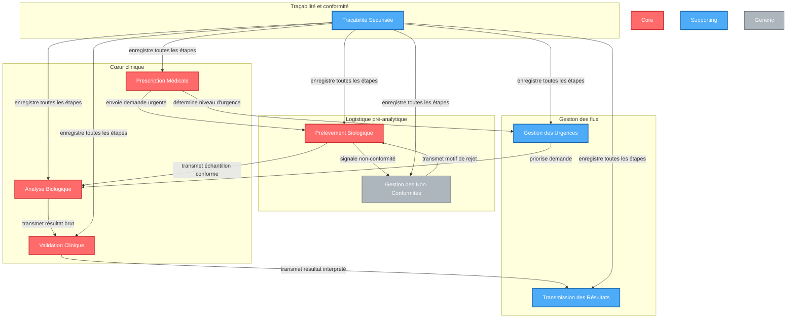

```mermaid
flowchart TD
    classDef core fill:#ff6b6b,stroke:#c92a2a,color:#fff,stroke-width:2px
    classDef supporting fill:#4dabf7,stroke:#1864ab,color:#fff,stroke-width:2px
    classDef generic fill:#adb5bd,stroke:#495057,color:#fff,stroke-width:1px

    subgraph Cœur clinique
        PrescriptionMédicale[Prescription Médicale]:::core
        AnalyseBiologique[Analyse Biologique]:::core
        ValidationClinique[Validation Clinique]:::core
    end

    subgraph Logistique pré-analytique
        PrélèvementBiologique[Prélèvement Biologique]:::core
        GestionNonConformités[Gestion des Non-Conformités]:::generic
    end

    subgraph Traçabilité et conformité
        TraçabilitéSécurisée[Traçabilité Sécurisée]:::supporting
    end

    subgraph Gestion des flux
        GestionUrgences[Gestion des Urgences]:::supporting
        TransmissionRésultats[Transmission des Résultats]:::supporting
    end

    PrescriptionMédicale -->|envoie demande urgente| PrélèvementBiologique
    PrescriptionMédicale -->|détermine niveau d'urgence| GestionUrgences
    PrélèvementBiologique -->|transmet échantillon conforme| AnalyseBiologique
    AnalyseBiologique -->|transmet résultat brut| ValidationClinique
    ValidationClinique -->|transmet résultat interprété| TransmissionRésultats
    GestionUrgences -->|priorise demande| AnalyseBiologique
    PrélèvementBiologique -->|signale non-conformité| GestionNonConformités
    GestionNonConformités -->|transmet motif de rejet| PrélèvementBiologique
    TraçabilitéSécurisée -->|enregistre toutes les étapes| PrescriptionMédicale
    TraçabilitéSécurisée -->|enregistre toutes les étapes| PrélèvementBiologique
    TraçabilitéSécurisée -->|enregistre toutes les étapes| AnalyseBiologique
    TraçabilitéSécurisée -->|enregistre toutes les étapes| ValidationClinique
    TraçabilitéSécurisée -->|enregistre toutes les étapes| TransmissionRésultats
    TraçabilitéSécurisée -->|enregistre toutes les étapes| GestionUrgences
    TraçabilitéSécurisée -->|enregistre toutes les étapes| GestionNonConformités

    Core[Core]:::core
    Supporting[Supporting]:::supporting
    Generic[Generic]:::generic
```