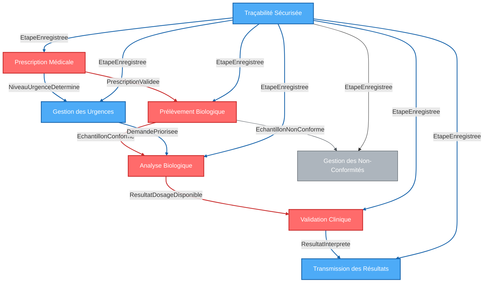

# **Identification des Bounded Contexts**
**Domaine : Circuit des demandes urgentes de dosage anti-Xa**
*Document de référence pour l'étape 5 (Strategic Design)*

---

## **1. Tableau récapitulatif des Bounded Contexts**

| **Bounded Context** | **Raison d'être métier** | **Sous-domaine(s) couvert(s)** | **Type stratégique** | **Acteurs principaux** | **Interactions clés** |
|---------------------|---------------------------|---------------------------------|----------------------|------------------------|------------------------|
| **PrescriptionMédicale** | Centraliser la création, validation et priorisation des demandes de dosage anti-Xa en intégrant les informations cliniques critiques pour une interprétation fiable. | Prescription Médicale | Core | Médecins prescripteurs, SIL | → PrélèvementBiologique (prescription validée) <br> → GestionUrgences (niveau d'urgence) |
| **PrélèvementBiologique** | Garantir la qualité et la traçabilité des échantillons biologiques depuis la collecte jusqu’au transport vers le laboratoire. | Prélèvement Biologique | Core | Personnel infirmier, Biologiste, SIL | → AnalyseBiologique (échantillon conforme) <br> → GestionNonConformités (rejets) |
| **AnalyseBiologique** | Réaliser les dosages anti-Xa en priorisant les demandes urgentes et en garantissant la qualité des résultats. | Analyse Biologique | Core | Techniciens de laboratoire, Biologiste, SIL | → ValidationClinique (résultats bruts) |
| **ValidationClinique** | Interpréter les résultats des dosages anti-Xa en intégrant le contexte clinique pour formuler des recommandations thérapeutiques claires et actionnables. | Validation Clinique | Core | Biologiste, Médecins prescripteurs | → TransmissionRésultats (résultats interprétés) |
| **TransmissionRésultats** | Assurer la transmission sécurisée et traçable des résultats et interprétations aux acteurs concernés. | Transmission des Résultats | Supporting | SIL, Médecins prescripteurs | → TraçabilitéSécurisée (logs) |
| **GestionUrgences** | Automatiser la priorisation et la gestion des demandes urgentes pour garantir une réactivité maximale. | Gestion des Urgences | Supporting | SIL, Médecins prescripteurs, Biologiste | → AnalyseBiologique (priorisation) <br> → PrescriptionMédicale (niveau d'urgence) |
| **TraçabilitéSécurisée** | Assurer la traçabilité complète et sécurisée de chaque étape du circuit, de la prescription à la transmission des résultats. | Traçabilité et Conformité | Supporting | SIL, Tous les acteurs | → Tous les Bounded Contexts (logs) |
| **GestionNonConformités** | Gérer les rejets d’échantillons et les alertes pour améliorer la qualité pré-analytique. | Gestion des Non-Conformités | Generic | Biologiste, SIL | → PrélèvementBiologique (rejets) |

---

## **2. Description détaillée des Bounded Contexts**

---

### **2.1. Bounded Context : PrescriptionMédicale**
**Raison d'être métier** :
Centraliser la **création**, la **validation** et la **priorisation** des **prescriptions médicales** pour les dosages anti-Xa en intégrant systématiquement les **informations cliniques critiques** (anticoagulant, dose, heure de la dernière prise, DFG) et en classant automatiquement le **niveau d'urgence** (urgence vitale / urgence standard). Ce Bounded Context est le point d’entrée du circuit et déclenche toutes les étapes ultérieures.

**Sous-domaines couverts** :
- **Prescription Médicale** (étape 4).

**Type stratégique** : **Core**

**Acteurs principaux** :
- **Médecins prescripteurs** (Urgences, Réanimation, Bloc opératoire).
- **SIL** (centralisation et validation des prescriptions).

**Règles métier internes** :
1. **Prescription obligatoire** :
   - Toute demande de dosage anti-Xa doit être précédée d’une **prescription médicale validée**.
   - *Source* : Étape 2 : 08_regles_metier.md (Enchaînement obligatoire).

2. **Champs obligatoires** :
   - **Anticoagulant** (ex : apixaban, rivaroxaban).
   - **Dose** (en mg ou UI).
   - **Heure de la dernière prise**.
   - **DFG** (Débit de Filtration Glomérulaire, en mL/min).
   - *Source* : Étape 2 : 08_regles_metier.md (Contraintes d'information clinique).

3. **Classification automatique des urgences** :
   - **Urgence vitale** : Exemples : hémorragie intracrânienne, choc hémorragique → **délai de réponse < 30 min**.
   - **Urgence standard** : Exemples : ajustement thérapeutique → **délai de réponse < 1h**.
   - *Source* : Étape 2 : 08_regles_metier.md (Règles de priorité), Étape 3 : 13_alignement_metier_technique.md.

4. **Alertes automatiques** :
   - Le SIL génère une **alerte** si :
     - Un champ obligatoire est manquant.
     - Les données saisies sont incohérentes (ex : heure de la dernière prise dans le futur).
   - *Source* : Étape 2 : 08_regles_metier.md (Règles de validation).

**Données manipulées** :
| **Donnée** | **Description** | **Format** |
|------------|-----------------|------------|
| `prescription_medicale` | Demande de dosage anti-Xa avec informations cliniques. | Objet structuré (JSON/XML) |
| `identifiant_unique` | Identifiant unique de la prescription (UUID). | UUID |
| `niveau_urgence` | Niveau d'urgence (urgence_vitale, urgence_standard). | Enum |
| `statut_prescription` | Statut de la prescription (en_attente, validee, rejetee). | Enum |

**Frontières** :
**Inclus** :
- Saisie des prescriptions médicales.
- Classification automatique des urgences.
- Génération d’alertes pour les erreurs de saisie.
- Intégration avec les systèmes de prescription existants (ex : DxCare).

**Exclus** :
- La vérification de la conformité des échantillons (géré par `PrélèvementBiologique`).
- L’analyse des dosages (géré par `AnalyseBiologique`).
- L’interprétation des résultats (géré par `ValidationClinique`).

---

### **2.2. Bounded Context : PrélèvementBiologique**
**Raison d'être métier** :
Garantir la **qualité** et la **traçabilité** des **échantillons biologiques** depuis la collecte jusqu’au transport vers le laboratoire, en vérifiant la conformité des tubes et en respectant les délais de transport. Ce Bounded Context est critique pour éviter les rejets d’échantillons et assurer des analyses fiables.

**Sous-domaines couverts** :
- **Prélèvement Biologique** (étape 4).

**Type stratégique** : **Core**

**Acteurs principaux** :
- **Personnel infirmier** (réalisation des prélèvements).
- **Biologiste** (décision de rejet).
- **SIL** (vérification de la conformité, enregistrement des actes).

**Règles métier internes** :
1. **Conformité des tubes** :
   - Type de tube : **citraté 3,2%**.
   - Volume ≥ **2 mL**.
   - *Source* : Étape 2 : 08_regles_metier.md (Contraintes de qualité pré-analytique).

2. **Étiquetage complet** :
   - Nom du patient.
   - Heure de prélèvement.
   - Service demandeur.
   - *Source* : Étape 2 : 08_regles_metier.md (Règles de validation).

3. **Délai de transport** :
   - Délai entre prélèvement et réception au laboratoire : **< 30 min**.
   - *Source* : Étape 2 : 08_regles_metier.md (Contraintes temporelles).

4. **Gestion des rejets** :
   - Si l’échantillon est non conforme, le SIL génère une **alerte** et notifie le personnel infirmier et le médecin prescripteur.
   - *Source* : Étape 2 : 08_regles_metier.md (Règles de rejet).

**Données manipulées** :
| **Donnée** | **Description** | **Format** |
|------------|-----------------|------------|
| `echantillon_biologique` | Matériel biologique prélevé (sang) dans un tube. | Objet structuré |
| `tube_prelevement` | Type de tube (citrate_3.2%, volume, étiquetage). | Enum |
| `acte_prelevement` | Action de prélèvement (opérateur, heure, lieu). | Objet structuré |
| `statut_conformite` | Statut de conformité (conforme, non_conforme). | Enum |

**Frontières** :
**Inclus** :
- Vérification de la conformité des tubes.
- Enregistrement des actes de prélèvement.
- Gestion des rejets d’échantillons non conformes.
- Respect des délais de transport.

**Exclus** :
- La prescription médicale (géré par `PrescriptionMédicale`).
- L’analyse des échantillons (géré par `AnalyseBiologique`).
- L’interprétation des résultats (géré par `ValidationClinique`).

---

### **2.3. Bounded Context : AnalyseBiologique**
**Raison d'être métier** :
Réaliser les **dosages anti-Xa** en priorisant les demandes urgentes et en garantissant la qualité des résultats, tout en respectant les délais de réponse définis. Ce Bounded Context est au cœur du processus analytique et doit être hautement performant pour répondre aux exigences cliniques.

**Sous-domaines couverts** :
- **Analyse Biologique** (étape 4).

**Type stratégique** : **Core**

**Acteurs principaux** :
- **Techniciens de laboratoire** (réalisation des analyses).
- **Biologiste** (validation des résultats).
- **SIL** (priorisation, enregistrement des résultats).

**Règles métier internes** :
1. **Priorisation automatique** :
   - Les demandes urgentes sont priorisées en fonction du niveau d’urgence (`urgence_vitale` ou `urgence_standard`).
   - *Source* : Étape 2 : 08_regles_metier.md (Règles de priorité).

2. **Délais de réponse** :
   - **Urgence vitale** : < 30 min.
   - **Urgence standard** : < 1h.
   - *Source* : Étape 2 : 08_regles_metier.md (Contraintes temporelles).

3. **Gestion des rejets** :
   - Les échantillons non conformes sont rejetés, et une **alerte** est générée.
   - *Source* : Étape 2 : 08_regles_metier.md (Règles de rejet).

4. **Traçabilité** :
   - Le SIL enregistre chaque analyse avec :
     - Identifiant unique de la demande.
     - Horodatage de début et de fin.
     - Nom du technicien responsable.
   - *Source* : Étape 2 : 08_regles_metier.md (Règles de traçabilité).

**Données manipulées** :
| **Donnée** | **Description** | **Format** |
|------------|-----------------|------------|
| `demande_priorisee` | Demande de dosage anti-Xa priorisée par le SIL. | Objet structuré |
| `resultat_dosage_anti_xa` | Résultat du dosage anti-Xa (valeur en UI/mL). | Nombre décimal |
| `statut_analyse` | Statut de l’analyse (en_cours, terminee, rejetee). | Enum |

**Frontières** :
**Inclus** :
- Priorisation automatique des demandes urgentes.
- Réalisation des dosages anti-Xa.
- Gestion des rejets d’échantillons non conformes.
- Enregistrement des résultats dans le SIL.

**Exclus** :
- La prescription médicale (géré par `PrescriptionMédicale`).
- Le prélèvement biologique (géré par `PrélèvementBiologique`).
- L’interprétation des résultats (géré par `ValidationClinique`).

---
### **2.4. Bounded Context : ValidationClinique**
**Raison d'être métier** :
Interpréter les **résultats des dosages anti-Xa** en intégrant le **contexte clinique** (traitement, fonction rénale, heure de la dernière prise) pour formuler des **recommandations thérapeutiques** claires et actionnables, et transmettre ces résultats aux **médecins prescripteurs** de manière sécurisée. Ce Bounded Context est critique pour la prise de décision médicale.

**Sous-domaines couverts** :
- **Validation Clinique** (étape 4).

**Type stratégique** : **Core**

**Acteurs principaux** :
- **Biologiste** (réalisation des interprétations).
- **Médecins prescripteurs** (réception des résultats).
- **SIL** (transmission des résultats, traçabilité).

**Règles métier internes** :
1. **Intégration du contexte clinique** :
   - L’interprétation du résultat doit inclure :
     - Le contexte clinique (traitement, DFG, heure de la dernière prise).
     - La valeur du dosage anti-Xa.
     - Une recommandation thérapeutique (ex : "Sous-dosage probable, envisager une transfusion").
   - *Source* : Étape 1 : 03_concepts_metier_initiaux.md (Interprétation des résultats).

2. **Transmission sécurisée** :
   - Les résultats doivent être transmis aux **médecins prescripteurs** dans les délais de réponse définis.
   - *Source* : Étape 2 : 08_regles_metier.md (Règles de transmission).

3. **Traçabilité** :
   - Le SIL enregistre chaque interprétation avec :
     - Identifiant unique de la demande.
     - Horodatage de l’interprétation.
     - Nom du biologiste responsable.
   - *Source* : Étape 2 : 08_regles_metier.md (Règles de traçabilité).

**Données manipulées** :
| **Donnée** | **Description** | **Format** |
|------------|-----------------|------------|
| `contexte_clinique` | Informations médicales pertinentes pour l’interprétation. | Objet structuré |
| `resultat_dosage_anti_xa` | Résultat du dosage anti-Xa (valeur en UI/mL). | Nombre décimal |
| `interpretation_resultat` | Commentaire et recommandation thérapeutique du biologiste. | Texte structuré |
| `statut_transmission` | Statut de transmission des résultats (envoye, recue, lu). | Enum |

**Frontières** :
**Inclus** :
- Intégration du contexte clinique dans l’interprétation.
- Rédaction d’interprétations claires et standardisées.
- Transmission sécurisée des résultats aux prescripteurs.
- Enregistrement des interprétations dans le SIL.

**Exclus** :
- La prescription médicale (géré par `PrescriptionMédicale`).
- Le prélèvement biologique (géré par `PrélèvementBiologique`).
- L’analyse biologique (géré par `AnalyseBiologique`).

---
### **2.5. Bounded Context : TransmissionRésultats**
**Raison d'être métier** :
Assurer la **transmission sécurisée** et **traçable** des résultats et interprétations aux acteurs concernés (médecins prescripteurs), en respectant les délais de réponse et les exigences de confidentialité. Ce Bounded Context est essentiel pour la prise en charge rapide et informée des patients.

**Sous-domaines couverts** :
- **Transmission des Résultats** (étape 4).

**Type stratégique** : **Supporting**

**Acteurs principaux** :
- **SIL** (centralisation des données).
- **Médecins prescripteurs** (réception des résultats).

**Règles métier internes** :
1. **Transmission en temps réel** :
   - Les résultats interprétés sont transmis aux **médecins prescripteurs** dès validation par le biologiste.
   - *Source* : Étape 2 : 08_regles_metier.md (Règles de transmission).

2. **Alertes en cas de dépassement** :
   - Le SIL génère une **alerte** si le délai de réponse est dépassé.
   - *Source* : Étape 2 : 08_regles_metier.md (Règles de traçabilité).

3. **Archivage conforme au RGPD** :
   - Les données sont archivées pendant **20 ans** avec accès restreint.
   - *Source* : Étape 2 : 08_regles_metier.md (Contraintes réglementaires).

**Données manipulées** :
| **Donnée** | **Description** | **Format** |
|------------|-----------------|------------|
| `resultat_interprete` | Résultat interprété avec recommandation thérapeutique. | Texte structuré |
| `statut_transmission` | Statut de transmission (envoye, recue, lu). | Enum |

**Frontières** :
**Inclus** :
- Transmission sécurisée des résultats.
- Génération d’alertes en cas de dépassement des délais.
- Archivage conforme au RGPD.

**Exclus** :
- La prescription médicale (géré par `PrescriptionMédicale`).
- L’analyse biologique (géré par `AnalyseBiologique`).

---
### **2.6. Bounded Context : GestionUrgences**
**Raison d'être métier** :
Automatiser la **priorisation** et la **gestion** des **demandes urgentes** pour garantir une réactivité maximale, en notifiant les acteurs concernés en temps réel et en surveillant les délais de réponse. Ce Bounded Context est crucial pour la sécurité des patients en situation critique.

**Sous-domaines couverts** :
- **Gestion des Urgences** (étape 4).

**Type stratégique** : **Supporting**

**Acteurs principaux** :
- **SIL** (priorisation, notifications).
- **Médecins prescripteurs** (réception des alertes).
- **Biologiste** (réception des alertes).
- **Techniciens de laboratoire** (réception des alertes).

**Règles métier internes** :
1. **Classification automatique des urgences** :
   - Les demandes sont classées en :
     - **Urgence vitale** (ex : hémorragie intracrânienne) → **délai de réponse < 30 min**.
     - **Urgence standard** (ex : ajustement thérapeutique) → **délai de réponse < 1h**.
   - *Source* : Étape 2 : 08_regles_metier.md (Règles de priorité).

2. **Notifications en temps réel** :
   - Le SIL notifie les acteurs concernés via :
     - Interface SIL.
     - Email.
     - SMS (si configuré).
   - *Source* : Étape 2 : 09_conflits_objectifs.md (Conflit : Communication des informations vs. Délai de réponse).

3. **Surveillance des délais** :
   - Le SIL génère une **alerte** si :
     - Un délai de réponse est dépassé.
     - Une demande prioritaire n’est pas traitée dans les temps.
   - *Source* : Étape 2 : 08_regles_metier.md (Règles de traçabilité).

**Données manipulées** :
| **Donnée** | **Description** | **Format** |
|------------|-----------------|------------|
| `niveau_urgence` | Niveau d'urgence (urgence_vitale, urgence_standard). | Enum |
| `delai_reponse` | Délai de réponse cible (en minutes). | Entier |
| `notification` | Notification envoyée aux acteurs concernés. | Objet structuré |

**Frontières** :
**Inclus** :
- Classification automatique des urgences.
- Notification en temps réel des acteurs.
- Surveillance des délais de réponse.
- Gestion dynamique des priorités.

**Exclus** :
- La prescription médicale (géré par `PrescriptionMédicale`).
- L’analyse biologique (géré par `AnalyseBiologique`).

---
### **2.7. Bounded Context : TraçabilitéSécurisée**
**Raison d'être métier** :
Assurer la **traçabilité complète** et **sécurisée** de chaque étape du circuit, de la **prescription médicale** à la **transmission des résultats**, tout en garantissant la protection des données patients conformément au RGPD. Ce Bounded Context est essentiel pour la conformité réglementaire et la transparence du processus.

**Sous-domaines couverts** :
- **Traçabilité et Conformité** (étape 4).

**Type stratégique** : **Supporting**

**Acteurs principaux** :
- **SIL** (centralisation des données).
- **Tous les acteurs** (consultation de la traçabilité).

**Règles métier internes** :
1. **Enregistrement systématique** :
   - Le SIL enregistre chaque étape du circuit avec :
     - Un **identifiant unique**.
     - Un horodatage précis.
     - Le nom de l’acteur responsable.
     - Le statut de l’étape (ex : "prescription validée", "échantillon conforme").
   - *Source* : Étape 2 : 08_regles_metier.md (Règles de traçabilité).

2. **Protection des données patients** :
   - Les données patients sont **chiffrées** (AES-256).
   - Les accès sont **restreints** et **tracés** (logs d’audit).
   - *Source* : Étape 2 : 08_regles_metier.md (Contraintes réglementaires).

3. **Génération d’alertes** :
   - Le SIL génère une **alerte** si :
     - Un délai de réponse est dépassé.
     - Une étape du circuit n’est pas enregistrée dans les délais.
     - Une non-conformité est détectée.
   - *Source* : Étape 2 : 08_regles_metier.md (Règles de traçabilité).

4. **Archivage** :
   - Les données sont archivées pendant **20 ans** avec accès restreint.
   - *Source* : Étape 2 : 08_regles_metier.md (Contraintes réglementaires).

**Données manipulées** :
| **Donnée** | **Description** | **Format** |
|------------|-----------------|------------|
| `traçabilité` | Historique complet des étapes du circuit. | Liste d’objets structurés |
| `alerte` | Notification automatique en cas de non-respect des règles. | Objet structuré |
| `logs_accès` | Journal des accès au SIL (qui, quand, quoi). | Fichier log structuré |

**Frontières** :
**Inclus** :
- Enregistrement systématique de toutes les étapes du circuit.
- Génération d’alertes en cas de non-respect des règles.
- Archivage sécurisé des données.
- Protection des données patients (RGPD).

**Exclus** :
- La réalisation des analyses (géré par `AnalyseBiologique`).
- L’interprétation des résultats (géré par `ValidationClinique`).

---
### **2.8. Bounded Context : GestionNonConformités**
**Raison d'être métier** :
Gérer les **rejets d’échantillons** et les **alertes** pour améliorer la qualité pré-analytique, en détectant les non-conformités (tube, volume, étiquetage) et en notifiant les acteurs concernés. Ce Bounded Context est générique et peut être externalisé ou standardisé.

**Sous-domaines couverts** :
- **Gestion des Non-Conformités** (étape 4).

**Type stratégique** : **Generic**

**Acteurs principaux** :
- **Biologiste** (décision de rejet).
- **SIL** (enregistrement des rejets, génération d’alertes).

**Règles métier internes** :
1. **Détection des non-conformités** :
   - Le SIL vérifie :
     - Type de tube (citraté 3,2%).
     - Volume ≥ 2 mL.
     - Étiquetage complet (nom du patient, heure de prélèvement).
   - *Source* : Étape 2 : 08_regles_metier.md (Règles de validation).

2. **Gestion des rejets** :
   - Si un échantillon est non conforme, le SIL :
     - Génère une **alerte** pour le biologiste.
     - Notifie le personnel infirmier et le médecin prescripteur.
     - Enregistre le rejet dans la traçabilité.
   - *Source* : Étape 2 : 08_regles_metier.md (Règles de rejet).

3. **Amélioration continue** :
   - Le SIL fournit des rapports de qualité pour identifier les causes récurrentes de non-conformité.
   - *Source* : Étape 2 : 09_conflits_objectifs.md (Conflit : Charge du personnel infirmier vs. Traçabilité).

**Données manipulées** :
| **Donnée** | **Description** | **Format** |
|------------|-----------------|------------|
| `conformite_echantillon` | Résultat de la vérification de conformité. | Enum |
| `motif_rejet` | Motif du rejet (ex : tube EDTA, volume insuffisant). | Texte structuré |
| `alerte_qualite` | Alerte générée en cas de non-conformité. | Objet structuré |

**Frontières** :
**Inclus** :
- Vérification de la conformité des échantillons.
- Gestion des rejets d’échantillons non conformes.
- Génération de rapports de qualité.

**Exclus** :
- La prescription médicale (géré par `PrescriptionMédicale`).
- L’analyse biologique (géré par `AnalyseBiologique`).

---

## **3. Bounded Contexts candidats à fusion ou scission**

### **3.1. Candidats à fusion**
| **Bounded Contexts** | **Justification** | **Risque de fusion** | **Décision** |
|----------------------|-------------------|-----------------------|--------------|
| **PrescriptionMédicale** et **GestionUrgences** | - Les deux sous-domaines partagent la logique de **classification des urgences** et de **priorisation**. <br> - La prescription médicale inclut déjà le niveau d'urgence, qui est utilisé par GestionUrgences. | - Risque de complexité accrue si fusionnés. <br> - Perte de séparation des responsabilités (prescription vs. gestion des flux). | **Décision** : **Ne pas fusionner**. <br> **Justification** : La séparation des responsabilités est claire (prescription médicale vs. gestion des flux) et facilite la maintenance. Utiliser un **événement métier** (`PrescriptionValidee`) pour synchroniser les deux contextes. |
| **PrélèvementBiologique** et **GestionNonConformités** | - Les deux sous-domaines partagent la logique de **conformité des échantillons** et de **gestion des rejets**. <br> - PrélèvementBiologique vérifie la conformité, tandis que GestionNonConformités gère les rejets et les alertes. | - Risque de couplage fort entre les deux contextes. <br> - Perte de modularité. | **Décision** : **Ne pas fusionner**. <br> **Justification** : La séparation des responsabilités est claire (vérification de la conformité vs. gestion des rejets). Utiliser un **événement métier** (`EchantillonNonConforme`) pour synchroniser les deux contextes. |

---
### **3.2. Candidats à scission**
| **Bounded Context** | **Justification** | **Risque de scission** | **Décision** |
|---------------------|-------------------|-------------------------|--------------|
| **TraçabilitéSécurisée** | - Ce Bounded Context est **transverse** à tous les autres et pourrait être scindé en deux parties : <br> 1. **Traçabilité des étapes** (enregistrement des événements). <br> 2. **Sécurité des données** (chiffrement, accès, RGPD). | - Risque de duplication des données si scindé. <br> - Complexité accrue pour les autres Bounded Contexts. | **Décision** : **Ne pas scinder**. <br> **Justification** : La traçabilité et la sécurité sont intrinsèquement liées dans ce contexte. Une scission rendrait le système plus complexe à maintenir et à synchroniser. |

---
### **3.3. Hypothèses de découpage retenues**
| **Hypothèse** | **Justification** | **Points à valider** |
|---------------|-------------------|----------------------|
| **Séparation claire entre PrescriptionMédicale et AnalyseBiologique** | - Les deux Bounded Contexts ont des finalités et des acteurs distincts. <br> - La prescription est un acte médical, tandis que l’analyse est un acte technique. | Valider avec les **médecins prescripteurs** et les **techniciens de laboratoire** que la séparation est pertinente et ne complique pas leur travail. |
| **Centralisation de la traçabilité dans TraçabilitéSécurisée** | - La traçabilité est un besoin transverse à tous les Bounded Contexts. <br> - Un Bounded Context dédié évite la duplication des données. | Valider avec l’**équipe SIL** que cette centralisation est techniquement réalisable et performante. |
| **Séparation entre GestionNonConformités et PrélèvementBiologique** | - GestionNonConformités se concentre sur la gestion des rejets, tandis que PrélèvementBiologique se concentre sur l’enregistrement de l’acte. <br> - Évite la redondance des vérifications. | Valider avec les **techniciens de laboratoire** et les **biologistes** que cette séparation est claire et ne crée pas de confusion. |

---

## **4. Cartographie des relations inter-contextes (Context Map)**

### **4.1. Relations entre Bounded Contexts**

| **Source** | **Cible** | **Type de relation** | **Pattern DDD** | **Contrat d'échange** | **Exemple d'événement métier** |
|------------|-----------|----------------------|-----------------|------------------------|--------------------------------|
| **PrescriptionMédicale** | **PrélèvementBiologique** | Asynchrone (événement) | **Customer/Supplier** | Prescription validée (avec niveau d'urgence) | `PrescriptionValidee` |
| **PrescriptionMédicale** | **GestionUrgences** | Synchrone | **Customer/Supplier** | Niveau d'urgence (vital/standard) | `NiveauUrgenceDetermine` |
| **PrélèvementBiologique** | **AnalyseBiologique** | Asynchrone (événement) | **Customer/Supplier** | Échantillon conforme (avec identifiant unique) | `EchantillonConforme` |
| **PrélèvementBiologique** | **GestionNonConformités** | Synchrone | **Customer/Supplier** | Rejet d’échantillon (motif) | `EchantillonNonConforme` |
| **AnalyseBiologique** | **ValidationClinique** | Asynchrone (événement) | **Customer/Supplier** | Résultat du dosage anti-Xa (valeur en UI/mL) | `ResultatDosageDisponible` |
| **ValidationClinique** | **TransmissionRésultats** | Asynchrone (événement) | **Customer/Supplier** | Résultat interprété (avec recommandation thérapeutique) | `ResultatInterprete` |
| **GestionUrgences** | **AnalyseBiologique** | Synchrone | **Customer/Supplier** | Niveau d'urgence (priorisation) | `DemandePriorisee` |
| **TraçabilitéSécurisée** | **Tous les Bounded Contexts** | Asynchrone (événement) | **Published Language** | Logs de traçabilité (étapes, horodatages) | `EtapeEnregistree` |
| **GestionNonConformités** | **PrélèvementBiologique** | Synchrone | **Customer/Supplier** | Motif de rejet (ex : tube EDTA) | `MotifRejetEnregistre` |

---
### **4.2. Description des patterns DDD utilisés**

| **Pattern** | **Description** | **Justification** | **Exemple** |
|-------------|-----------------|-------------------|-------------|
| **Customer/Supplier** | Relation où le contexte **Customer** (source) dépend du contexte **Supplier** (cible) pour obtenir des données ou des services. | - Utilisé pour les échanges de données critiques entre Bounded Contexts. <br> - Garantit une séparation claire des responsabilités. | `PrescriptionMédicale` (Customer) → `PrélèvementBiologique` (Supplier) : Envoi d'une prescription validée. |
| **Published Language** | Langage commun partagé entre plusieurs Bounded Contexts pour échanger des données de manière standardisée. | - Utilisé pour la **traçabilité**, où tous les Bounded Contexts doivent enregistrer leurs actions. <br> - Garantit une cohérence globale des logs. | `TraçabilitéSécurisée` publie un **événement métier** `EtapeEnregistree` que tous les autres Bounded Contexts consomment. |

---
### **4.3. Contrats d'échange détaillés**

#### **Contrat 1 : PrescriptionMédicale → PrélèvementBiologique**
- **Type de relation** : **Customer/Supplier** (asynchrone, événementiel).
- **Événement métier** : `PrescriptionValidee`.
- **Données échangées** :
  ```json
  {
    "prescription_id": "DEM-2023-001",
    "patient_id": "PAT123",
    "anticoagulant": "apixaban",
    "dose": 5,
    "heure_derniere_prise": "10:00",
    "dfg": 35,
    "niveau_urgence": "urgence_vitale",
    "statut": "validee"
  }
  ```
- **Format** : JSON.
- **Fréquence** : Une fois par prescription validée.
- **Garanties** :
  - L’événement est **idempotent** (pas de duplication).
  - Le contrat est **versionné** pour permettre des évolutions futures.

#### **Contrat 2 : PrélèvementBiologique → AnalyseBiologique**
- **Type de relation** : **Customer/Supplier** (asynchrone, événementiel).
- **Événement métier** : `EchantillonConforme`.
- **Données échangées** :
  ```json
  {
    "echantillon_id": "ECH-2023-001",
    "prescription_id": "DEM-2023-001",
    "type_tube": "citrate_3.2%",
    "volume": 2.5,
    "etiquetage": {
      "nom_patient": "Dupont",
      "heure_prelevement": "10:30",
      "service": "Urgences"
    },
    "statut_conformite": "conforme"
  }
  ```
- **Format** : JSON.
- **Fréquence** : Une fois par échantillon conforme.
- **Garanties** :
  - L’échantillon est **traçable** via l’`identifiant_unique`.
  - Le contrat est **versionné**.

#### **Contrat 3 : AnalyseBiologique → ValidationClinique**
- **Type de relation** : **Customer/Supplier** (asynchrone, événementiel).
- **Événement métier** : `ResultatDosageDisponible`.
- **Données échangées** :
  ```json
  {
    "analyse_id": "ANA-2023-001",
    "echantillon_id": "ECH-2023-001",
    "resultat": 0.5,
    "unite": "UI/mL",
    "statut": "terminee"
  }
  ```
- **Format** : JSON.
- **Fréquence** : Une fois par analyse terminée.
- **Garanties** :
  - Le résultat est **associé à l’échantillon** via l’`identifiant_unique`.
  - Le contrat est **versionné**.

#### **Contrat 4 : ValidationClinique → TransmissionRésultats**
- **Type de relation** : **Customer/Supplier** (asynchrone, événementiel).
- **Événement métier** : `ResultatInterprete`.
- **Données échangées** :
  ```json
  {
    "interpretation_id": "INT-2023-001",
    "analyse_id": "ANA-2023-001",
    "contexte_clinique": {
      "anticoagulant": "apixaban",
      "dfg": 35,
      "heure_derniere_prise": "10:00"
    },
    "interpretation": "Sous-dosage probable, envisager une transfusion.",
    "recommandation": "Surveillance renforcée et ajustement de la dose."
  }
  ```
- **Format** : JSON.
- **Fréquence** : Une fois par interprétation terminée.
- **Garanties** :
  - L’interprétation est **associée à l’analyse** via l’`identifiant_unique`.
  - Le contrat est **versionné**.

#### **Contrat 5 : TraçabilitéSécurisée → Tous les Bounded Contexts**
- **Type de relation** : **Published Language** (asynchrone, événementiel).
- **Événement métier** : `EtapeEnregistree`.
- **Données échangées** :
  ```json
  {
    "traçabilité_id": "TRACE-2023-001",
    "bounded_context": "PrescriptionMédicale",
    "action": "prescription_validee",
    "horodatage": "2023-10-01T10:00:00Z",
    "acteur": "Dr Martin",
    "identifiant_unique": "DEM-2023-001"
  }
  ```
- **Format** : JSON.
- **Fréquence** : Une fois par étape enregistrée.
- **Garanties** :
  - Tous les Bounded Contexts **publient** leurs événements à `TraçabilitéSécurisée`.
  - Les données sont **chiffrées** (AES-256).
  - Les logs sont **immuables** (pas de modification possible).

---
### **4.4. Schéma de la Context Map**


---
## **5. Hypothèses retenues et points à valider auprès du métier**

### **5.1. Hypothèses de découpage retenues**
| **Hypothèse** | **Justification** | **Points à valider** |
|---------------|-------------------|----------------------|
| **Séparation claire entre PrescriptionMédicale et GestionUrgences** | - Les deux Bounded Contexts ont des finalités et des acteurs distincts. <br> - La prescription médicale inclut déjà le niveau d'urgence, qui est utilisé par GestionUrgences. | Valider avec les **médecins prescripteurs** et les **techniciens de laboratoire** que la séparation est pertinente et ne complique pas leur travail. |
| **Centralisation de la traçabilité dans TraçabilitéSécurisée** | - La traçabilité est un besoin transverse à tous les Bounded Contexts. <br> - Un Bounded Context dédié évite la duplication des données. | Valider avec l’**équipe SIL** que cette centralisation est techniquement réalisable et performante. |
| **Séparation entre GestionNonConformités et PrélèvementBiologique** | - GestionNonConformités se concentre sur la gestion des rejets, tandis que PrélèvementBiologique se concentre sur l’enregistrement de l’acte. <br> - Évite la redondance des vérifications. | Valider avec les **techniciens de laboratoire** et les **biologistes** que cette séparation est claire et ne crée pas de confusion. |

---
### **5.2. Points à clarifier auprès du métier**
| **Point à clarifier** | **Contexte** | **Questions à poser** | **Acteurs à consulter** |
|-----------------------|--------------|-----------------------|-------------------------|
| **Critères précis de conformité des tubes de prélèvement** | Aucune liste explicite des normes de tubes ou de volumes n’est fournie dans le corpus. | - Quels sont les types de tubes acceptés (ex : tube citraté 3,2%) ? <br> - Quel est le volume minimal requis pour l’analyse ? <br> - Quels sont les protocoles d’étiquetage (ex : étiquette machine-readable, nom du patient, heure de prélèvement) ? | Biologiste, Techniciens de laboratoire, Personnel infirmier |
| **Mécanismes de priorisation des demandes urgentes** | Le corpus mentionne des délais de *"1 heure"* et *"30 minutes"* pour les urgences, mais aucune définition claire des critères pour distinguer une urgence vitale d’une urgence standard. | - Quels sont les critères de classement des urgences (ex : score clinique, type d’anticoagulant, fonction rénale) ? <br> - Quels sont les délais de réponse cibles par niveau de priorité ? | Médecins prescripteurs (Urgences, Réanimation), Biologiste |
| **Protocole standardisé de transmission des informations cliniques** | Aucune standardisation n’est décrite dans le corpus, bien que cela soit identifié comme un irritant métier. | - Quels sont les champs obligatoires à remplir dans la prescription (ex : nom de l’anticoagulant, dose, heure de la dernière prise, DFG) ? <br> - Quel est le format de transmission (ex : champ libre, liste déroulante, intégration automatique depuis le dossier patient) ? | Médecins prescripteurs, Personnel infirmier, Biologiste |
| **Intégration avec les systèmes existants** | Aucune information n’est fournie sur la compatibilité du SIL avec les logiciels de prescription (ex : DxCare, Cristal) ou les automates de dosage anti-Xa. | - Quels sont les systèmes existants à intégrer (ex : DxCare, Cristal) ? <br> - Quelle est la capacité d’interfaçage avec les automates de dosage anti-Xa ? | Équipe SIL, Biologiste, Équipe informatique |

---
### **5.3. Contradictions ou ambiguïtés identifiées dans les sources**
| **Élément** | **Contradiction / Ambiguïté** | **Source** | **Proposition de résolution** |
|-------------|-------------------------------|------------|-------------------------------|
| **Délai de réponse pour les urgences vitales** | Le corpus mentionne à la fois *"30 minutes"* (Étape 2 : 09_conflits_objectifs.md) et *"1 heure"* (Étape 2 : 08_regles_metier.md). | Étape 2 : 08_regles_metier.md vs. Étape 2 : 09_conflits_objectifs.md | **Hypothèse** : Les urgences vitales critiques (ex : hémorragie intracrânienne) ont un délai de 30 min, tandis que les urgences vitales standard (ex : ajustement thérapeutique urgent) ont un délai de 1h. À valider avec les cliniciens. |
| **Critères de conformité des échantillons** | Aucune liste explicite des normes de tubes ou de volumes n’est fournie. Les mentions sont génériques (ex : *"normes strictes"* dans Étape 1 : 04_contraintes_et_risques.md). | Étape 1 : 04_contraintes_et_risques.md | **Hypothèse** : Utiliser les normes ISO 15189 et CLSI GP41 comme référence (tube citraté 3,2%, volume ≥ 2 mL). À valider avec le laboratoire. |
| **Transmission des informations cliniques** | Aucune standardisation n’est décrite dans le corpus, bien que cela soit identifié comme un irritant métier (Étape 1 : 05_vision_globale_du_domaine.md). | Étape 1 : 05_vision_globale_du_domaine.md | **Hypothèse** : Créer un formulaire standardisé avec les champs obligatoires (anticoagulant, dose, heure de la dernière prise, DFG). À valider avec les médecins prescripteurs. |

---
## **6. Synthèse des décisions stratégiques**

### **6.1. Bounded Contexts Core (prioritaires pour la conception)**
- **PrescriptionMédicale** : À concevoir en premier, car c’est le point d’entrée du circuit.
- **AnalyseBiologique** : Critique pour la réalisation des dosages et le respect des délais.
- **ValidationClinique** : Essentielle pour l’interprétation des résultats et les recommandations thérapeutiques.
- **PrélèvementBiologique** : Garantit la qualité des échantillons et évite les rejets inutiles.

### **6.2. Bounded Contexts Supporting (à concevoir après les Core)**
- **GestionUrgences** : Améliore la réactivité et doit être intégré aux autres Bounded Contexts.
- **TransmissionRésultats** : Assure la transmission sécurisée des résultats.
- **TraçabilitéSécurisée** : Nécessaire pour la conformité réglementaire.

### **6.3. Bounded Context Generic (à externaliser ou standardiser)**
- **GestionNonConformités** : Peut être partiellement externalisé (ex : outils de vision par ordinateur pour la détection des étiquettes).

---
## **7. Annexe : Glossaire des termes clés**

| **Terme** | **Définition** |
|-----------|----------------|
| **Bounded Context** | Frontière logique dans laquelle un modèle est défini et cohérent. |
| **Core** | Bounded Context critique pour la différenciation métier et la valeur clinique. |
| **Supporting** | Bounded Context essentiel mais non différenciateur. |
| **Generic** | Bounded Context interchangeable, souvent externalisable. |
| **PrescriptionMédicale** | Acte par lequel un médecin prescrit un dosage anti-Xa pour un patient sous anticoagulant oral direct, incluant les informations cliniques nécessaires. |
| **PrélèvementBiologique** | Organisation et traçabilité de l’acte de prélèvement et des échantillons biologiques. |
| **AnalyseBiologique** | Réalisation des dosages anti-Xa et validation des résultats. |
| **ValidationClinique** | Interprétation des résultats des dosages anti-Xa en intégrant le contexte clinique. |
| **TransmissionRésultats** | Transmission sécurisée et traçable des résultats aux acteurs concernés. |
| **GestionUrgences** | Priorisation automatique des demandes urgentes et génération d’alertes. |
| **TraçabilitéSécurisée** | Enregistrement et archivage de toutes les étapes du circuit pour la conformité réglementaire. |
| **GestionNonConformités** | Gestion des rejets d’échantillons et des alertes pour améliorer la qualité pré-analytique. |

---
## **8. Annexe : Sources et références**

| **Source** | **Description** |
|------------|-----------------|
| **demande_biologiste.md** | Demande initiale du biologiste pour l’évolution du SIL. |
| **01_reformulation_du_besoin.md** | Reformulation claire du besoin et objectifs opérationnels. |
| **02_acteurs_du_domaine.md** | Cartographie des acteurs et leurs interactions. |
| **03_concepts_metier_initiaux.md** | Liste des concepts métier initiaux. |
| **04_contraintes_et_risques.md** | Contraintes temporelles, de qualité et réglementaires. |
| **05_vision_globale_du_domaine.md** | Synthèse des enjeux et objectifs du futur circuit. |
| **06_cartographie_acteurs.md** | Détail des acteurs et leurs rôles. |
| **07_responsabilites_acteurs.md** | Responsabilités opérationnelles et décisions clés par acteur. |
| **08_regles_metier.md** | Règles de validation, priorité, sécurité et documentation. |
| **09_conflits_objectifs.md** | Conflits d’objectifs et pistes d’arbitrage. |
| **10_synthese_etape2.md** | Synthèse des acteurs, règles et conflits. |
| **11_glossaire_metier.md** | Glossaire du langage commun (termes canoniques). |
| **12_ambiguites_resolues.md** | Arbitrages terminologiques et résolution des ambiguïtés. |
| **13_alignement_metier_technique.md** | Alignement entre vocabulaire métier et technique. |
| **14_exemples_langage_commun.md** | Exemples d’usage du langage commun. |
| **16_decoupage_sous_domaines.md** | Découpage en sous-domaines (étape 4). |
| **17_classification_strategique.md** | Classification stratégique des sous-domaines (étape 4). |
| **Normes ISO 15189** | Normes pour les laboratoires d'analyses de biologie médicale. |
| **Normes CLSI GP41** | Normes pour la gestion pré-analytique des échantillons biologiques. |
| **RGPD** | Règlement Général sur la Protection des Données. |
| **Code de la santé publique** | Réglementation française pour les prescriptions médicales.