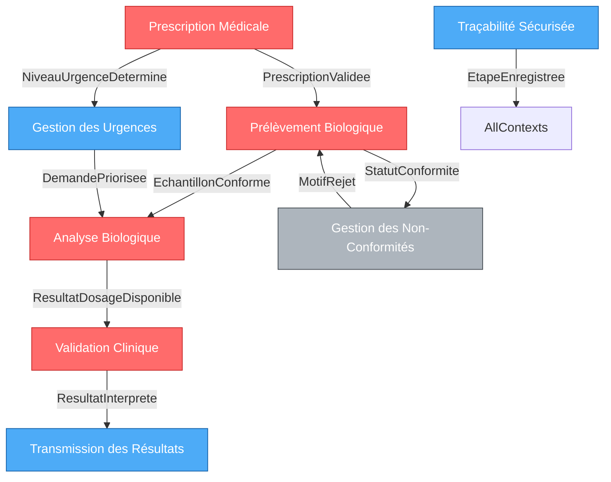

Voici une **proposition de Context Map détaillée** pour le domaine du **Circuit des demandes urgentes de dosage anti-Xa**, incluant :
1. **La définition des Bounded Contexts** (périmètre, responsabilités, vocabulaire, règles internes).
2. **La cartographie des relations inter-contextes** avec les patterns DDD canoniques.
3. **Les contrats d'échange** (formats, protocoles, exemples).
4. **Les hypothèses retenues et points à valider**.

---

---

## **1. Bounded Contexts : Définition Complète**
*(Basée sur les livrables des étapes 1-4 et les règles métier validées)*

---

### **1.1. PrescriptionMédicale**
**Raison d'être métier** :
Centraliser la **création**, la **validation** et la **priorisation automatique** des prescriptions médicales pour les dosages anti-Xa, en intégrant les **informations cliniques critiques** (anticoagulant, dose, heure de la dernière prise, DFG). Ce contexte est le **point d'entrée unique** du circuit et déclenche toutes les étapes ultérieures (prélèvement, analyse, validation).

**Sous-domaine(s) couvert(s)** :
- **Prescription Médicale** (Core).

**Acteurs principaux** :
- **Médecins prescripteurs** (Urgences, Réanimation, Bloc opératoire).
- **SIL** (centralisation et validation des prescriptions).

**Vocabulaire stable** *(issu de l'étape 3)* :
| **Terme**                     | **Définition**                                                                                     | **Exemple**                                                                                     |
|-------------------------------|---------------------------------------------------------------------------------------------------|-------------------------------------------------------------------------------------------------|
| `prescription_medicale`       | Acte médical prescrivant un dosage anti-Xa avec données cliniques.                                | `{anticoagulant: "apixaban", dose: 5, heure_derniere_prise: "10:00", dfg: 35}`                  |
| `niveau_urgence`              | Niveau de priorité de la prescription (`urgence_vitale`, `urgence_standard`).                     | `urgence_vitale`                                                                               |
| `statut_prescription`         | Statut de la prescription (`en_attente`, `validee`, `rejetee`).                                   | `validee`                                                                                      |
| `identifiant_unique`          | UUID généré pour chaque prescription.                                                              | `"DEM-2023-001"`                                                                               |

**Règles internes** :
1. **Prescription obligatoire** :
   - Toute demande de dosage anti-Xa doit être précédée d’une **prescription médicale validée**.
   - *Source* : Étape 2 : `08_regles_metier.md` (Règle 01).

2. **Champs obligatoires** :
   - **Anticoagulant** (ex : apixaban, rivaroxaban).
   - **Dose** (en mg ou UI).
   - **Heure de la dernière prise**.
   - **DFG** (Débit de Filtration Glomérulaire, en mL/min).
   - *Source* : Étape 2 : `08_regles_metier.md` (Contraintes d'information clinique).

3. **Classification automatique des urgences** :
   - **Urgence vitale** : Exemples : hémorragie intracrânienne, choc hémorragique → **délai de réponse < 30 min**.
   - **Urgence standard** : Exemples : ajustement thérapeutique → **délai de réponse < 1h**.
   - *Source* : Étape 2 : `08_regles_metier.md` (Règles de priorité), Étape 3 : `13_alignement_metier_technique.md`.

4. **Alertes automatiques** :
   - Le SIL génère une **alerte** si :
     - Un champ obligatoire est manquant.
     - Les données saisies sont incohérentes (ex : heure de la dernière prise dans le futur).
   - *Source* : Étape 2 : `08_regles_metier.md` (Règles de validation).

**Données manipulées** :
| **Donnée**               | **Description**                                                                                     | **Format**       |
|--------------------------|-----------------------------------------------------------------------------------------------------|------------------|
| `prescription_medicale`  | Objet structuré contenant les données cliniques et le niveau d'urgence.                              | JSON             |
| `identifiant_unique`     | UUID généré pour chaque prescription.                                                                | UUID             |
| `niveau_urgence`         | Enum : `urgence_vitale`, `urgence_standard`.                                                        | Enum             |
| `statut_prescription`    | Enum : `en_attente`, `validee`, `rejetee`.                                                          | Enum             |

**Frontières** :
**Inclus** :
- Saisie des prescriptions médicales.
- Classification automatique des urgences.
- Génération d’alertes pour les erreurs de saisie.
- Intégration avec les systèmes de prescription existants (ex : DxCare).

**Exclus** :
- La vérification de la conformité des échantillons (géré par `PrélèvementBiologique`).
- L’analyse des dosages (géré par `AnalyseBiologique`).
- L’interprétation des résultats (géré par `ValidationClinique`).

---

### **1.2. PrélèvementBiologique**
**Raison d'être métier** :
Garantir la **qualité** et la **traçabilité** des **échantillons biologiques** depuis la collecte jusqu’au transport vers le laboratoire, en vérifiant la conformité des tubes et en respectant les délais de transport. Ce contexte est **critique** pour éviter les rejets d’échantillons et assurer des analyses fiables.

**Sous-domaine(s) couvert(s)** :
- **Prélèvement Biologique** (Core).

**Acteurs principaux** :
- **Personnel infirmier** (réalisation des prélèvements).
- **Biologiste** (décision de rejet).
- **SIL** (vérification de la conformité, enregistrement des actes).

**Vocabulaire stable** :
| **Terme**                     | **Définition**                                                                                     | **Exemple**                                                                                     |
|-------------------------------|---------------------------------------------------------------------------------------------------|-------------------------------------------------------------------------------------------------|
| `echantillon_biologique`     | Matériel biologique prélevé (sang) dans un tube.                                                  | `{tube: "citrate_3.2%", volume: 2.5, etiquetage: {...}}`                                        |
| `tube_prelevement`            | Type de tube (citrate 3.2%), volume, étiquetage.                                                  | `citrate_3.2%`                                                                                 |
| `acte_prelevement`            | Action de prélèvement (opérateur, heure, lieu).                                                   | `{operateur: "Infirmier Dupont", heure: "10:30", service: "Urgences"}`                         |
| `statut_conformite`           | Statut de conformité (`conforme`, `non_conforme`).                                                 | `conforme`                                                                                     |

**Règles internes** :
1. **Conformité des tubes** :
   - Type de tube : **citraté 3,2%**.
   - Volume ≥ **2 mL**.
   - *Source* : Étape 2 : `08_regles_metier.md` (Contraintes de qualité pré-analytique).

2. **Étiquetage complet** :
   - Nom du patient.
   - Heure de prélèvement.
   - Service demandeur.
   - *Source* : Étape 2 : `08_regles_metier.md` (Règles de validation).

3. **Délai de transport** :
   - Délai entre prélèvement et réception au laboratoire : **< 30 min**.
   - *Source* : Étape 2 : `08_regles_metier.md` (Contraintes temporelles).

4. **Gestion des rejets** :
   - Si l’échantillon est non conforme, le SIL génère une **alerte** et notifie le personnel infirmier et le médecin prescripteur.
   - *Source* : Étape 2 : `08_regles_metier.md` (Règles de rejet).

**Données manipulées** :
| **Donnée**               | **Description**                                                                                     | **Format**       |
|--------------------------|-----------------------------------------------------------------------------------------------------|------------------|
| `echantillon_biologique` | Objet structuré contenant les données du prélèvement.                                              | JSON             |
| `tube_prelevement`       | Enum : `citrate_3.2%`.                                                                             | Enum             |
| `acte_prelevement`       | Objet structuré avec opérateur, heure, service.                                                    | JSON             |
| `statut_conformite`      | Enum : `conforme`, `non_conforme`.                                                                 | Enum             |

**Frontières** :
**Inclus** :
- Vérification de la conformité des tubes.
- Enregistrement des actes de prélèvement.
- Gestion des rejets d’échantillons non conformes.
- Respect des délais de transport.

**Exclus** :
- La prescription médicale (géré par `PrescriptionMédicale`).
- L’analyse des échantillons (géré par `AnalyseBiologique`).
- L’interprétation des résultats (géré par `ValidationClinique`).

---

### **1.3. AnalyseBiologique**
**Raison d'être métier** :
Réaliser les **dosages anti-Xa** en priorisant les demandes urgentes et en garantissant la qualité des résultats, tout en respectant les délais de réponse définis. Ce contexte est **au cœur du processus technique** et doit être **rapide**, **fiable** et **intégré** aux autres étapes du circuit.

**Sous-domaine(s) couvert(s)** :
- **Analyse Biologique** (Core).

**Acteurs principaux** :
- **Techniciens de laboratoire** (réalisation des analyses).
- **Biologiste** (validation des résultats).
- **SIL** (priorisation, enregistrement des résultats).

**Vocabulaire stable** :
| **Terme**                     | **Définition**                                                                                     | **Exemple**                                                                                     |
|-------------------------------|---------------------------------------------------------------------------------------------------|-------------------------------------------------------------------------------------------------|
| `demande_priorisee`           | Demande de dosage anti-Xa priorisée par le SIL.                                                  | `{prescription_id: "DEM-2023-001", niveau_urgence: "urgence_vitale"}`                        |
| `resultat_dosage_anti_xa`     | Résultat du dosage anti-Xa (valeur en UI/mL).                                                     | `1.2`                                                                                          |
| `statut_analyse`              | Statut de l’analyse (`en_cours`, `terminee`, `rejetee`).                                           | `terminee`                                                                                     |

**Règles internes** :
1. **Priorisation automatique** :
   - Les demandes urgentes sont priorisées en fonction du niveau d’urgence (`urgence_vitale` ou `urgence_standard`).
   - *Source* : Étape 2 : `08_regles_metier.md` (Règles de priorité).

2. **Délais de réponse** :
   - **Urgence vitale** : < 30 min.
   - **Urgence standard** : < 1h.
   - *Source* : Étape 2 : `08_regles_metier.md` (Contraintes temporelles).

3. **Gestion des rejets** :
   - Les échantillons non conformes sont rejetés, et une **alerte** est générée.
   - *Source* : Étape 2 : `08_regles_metier.md` (Règles de rejet).

4. **Traçabilité** :
   - Le SIL enregistre chaque analyse avec :
     - Identifiant unique de la demande.
     - Horodatage de début et de fin.
     - Nom du technicien responsable.
   - *Source* : Étape 2 : `08_regles_metier.md` (Règles de traçabilité).

**Données manipulées** :
| **Donnée**               | **Description**                                                                                     | **Format**       |
|--------------------------|-----------------------------------------------------------------------------------------------------|------------------|
| `demande_priorisee`      | Objet structuré avec prescription_id et niveau_urgence.                                            | JSON             |
| `resultat_dosage_anti_xa`| Valeur numérique du dosage.                                                                         | Nombre décimal   |
| `statut_analyse`         | Enum : `en_cours`, `terminee`, `rejetee`.                                                          | Enum             |

**Frontières** :
**Inclus** :
- Priorisation automatique des demandes urgentes.
- Réalisation des dosages anti-Xa.
- Gestion des rejets d’échantillons non conformes.
- Enregistrement des résultats dans le SIL.

**Exclus** :
- La prescription médicale (géré par `PrescriptionMédicale`).
- Le prélèvement biologique (géré par `PrélèvementBiologique`).
- L’interprétation des résultats (géré par `ValidationClinique`).

---

### **1.4. ValidationClinique**
**Raison d'être métier** :
Interpréter les **résultats des dosages anti-Xa** en intégrant le **contexte clinique** (traitement, fonction rénale, heure de la dernière prise) pour formuler des **recommandations thérapeutiques** claires et actionnables, et transmettre ces résultats aux **médecins prescripteurs** de manière sécurisée. Ce contexte est **critique pour la prise de décision médicale**.

**Sous-domaine(s) couvert(s)** :
- **Validation Clinique** (Core).

**Acteurs principaux** :
- **Biologiste** (réalisation des interprétations).
- **Médecins prescripteurs** (réception des résultats).
- **SIL** (transmission des résultats, traçabilité).

**Vocabulaire stable** :
| **Terme**                     | **Définition**                                                                                     | **Exemple**                                                                                     |
|-------------------------------|---------------------------------------------------------------------------------------------------|-------------------------------------------------------------------------------------------------|
| `contexte_clinique`          | Informations médicales pertinentes pour l’interprétation (traitement, DFG, heure de la dernière prise). | `{traitement: "apixaban", dfg: 35, heure_derniere_prise: "10:00"}`                             |
| `interpretation_resultat`     | Commentaire et recommandation thérapeutique du biologiste.                                        | `"Sous-dosage probable, envisager une transfusion"`                                             |
| `statut_transmission`         | Statut de transmission des résultats (`envoye`, `recue`, `lu`).                                   | `envoye`                                                                                       |

**Règles internes** :
1. **Intégration du contexte clinique** :
   - L’interprétation du résultat doit inclure :
     - Le contexte clinique (traitement, DFG, heure de la dernière prise).
     - La valeur du dosage anti-Xa.
     - Une recommandation thérapeutique (ex : "Sous-dosage probable, envisager une transfusion").
   - *Source* : Étape 1 : `03_concepts_metier_initiaux.md` (Interprétation des résultats).

2. **Transmission sécurisée** :
   - Les résultats doivent être transmis aux **médecins prescripteurs** dans les délais de réponse définis.
   - *Source* : Étape 2 : `08_regles_metier.md` (Règles de transmission).

3. **Traçabilité** :
   - Le SIL enregistre chaque interprétation avec :
     - Identifiant unique de la demande.
     - Horodatage de l’interprétation.
     - Nom du biologiste responsable.
   - *Source* : Étape 2 : `08_regles_metier.md` (Règles de traçabilité).

**Données manipulées** :
| **Donnée**               | **Description**                                                                                     | **Format**       |
|--------------------------|-----------------------------------------------------------------------------------------------------|------------------|
| `contexte_clinique`     | Objet structuré avec traitement, DFG, heure de la dernière prise.                                  | JSON             |
| `interpretation_resultat`| Texte structuré avec recommandation thérapeutique.                                                  | Texte            |
| `statut_transmission`    | Enum : `envoye`, `recue`, `lu`.                                                                    | Enum             |

**Frontières** :
**Inclus** :
- Intégration du contexte clinique dans l’interprétation.
- Rédaction d’interprétations claires et standardisées.
- Transmission sécurisée des résultats aux prescripteurs.
- Enregistrement des interprétations dans le SIL.

**Exclus** :
- La prescription médicale (géré par `PrescriptionMédicale`).
- Le prélèvement biologique (géré par `PrélèvementBiologique`).
- L’analyse biologique (géré par `AnalyseBiologique`).

---
### **1.5. TransmissionRésultats**
**Raison d'être métier** :
Assurer la **transmission sécurisée** et **traçable** des résultats et interprétations aux acteurs concernés (médecins prescripteurs), en respectant les délais de réponse et les exigences de confidentialité.

**Sous-domaine(s) couvert(s)** :
- **Transmission des Résultats** (Supporting).

**Acteurs principaux** :
- **SIL** (centralisation des données).
- **Médecins prescripteurs** (réception des résultats).

**Vocabulaire stable** :
| **Terme**                     | **Définition**                                                                                     | **Exemple**                                                                                     |
|-------------------------------|---------------------------------------------------------------------------------------------------|-------------------------------------------------------------------------------------------------|
| `resultat_interprete`         | Résultat interprété avec recommandation thérapeutique.                                            | `{interpretation: "Sous-dosage probable", recommandation: "Transfusion"}`                     |

**Règles internes** :
1. **Transmission en temps réel** :
   - Les résultats interprétés sont transmis aux **médecins prescripteurs** dès validation par le biologiste.
   - *Source* : Étape 2 : `08_regles_metier.md` (Règles de transmission).

2. **Alertes en cas de dépassement** :
   - Le SIL génère une **alerte** si le délai de réponse est dépassé.
   - *Source* : Étape 2 : `08_regles_metier.md` (Règles de traçabilité).

3. **Archivage conforme au RGPD** :
   - Les données sont archivées pendant **20 ans** avec accès restreint.
   - *Source* : Étape 2 : `08_regles_metier.md` (Contraintes réglementaires).

**Données manipulées** :
| **Donnée**               | **Description**                                                                                     | **Format**       |
|--------------------------|-----------------------------------------------------------------------------------------------------|------------------|
| `resultat_interprete`    | Objet structuré avec interprétation et recommandation.                                              | JSON             |

**Frontières** :
**Inclus** :
- Transmission sécurisée des résultats.
- Génération d’alertes en cas de dépassement des délais.
- Archivage conforme au RGPD.

**Exclus** :
- La prescription médicale (géré par `PrescriptionMédicale`).
- L’analyse biologique (géré par `AnalyseBiologique`).

---
### **1.6. GestionUrgences**
**Raison d'être métier** :
Automatiser la **priorisation** et la **gestion** des **demandes urgentes** pour garantir une réactivité maximale, en notifiant les acteurs concernés en temps réel et en surveillant les délais de réponse.

**Sous-domaine(s) couvert(s)** :
- **Gestion des Urgences** (Supporting).

**Acteurs principaux** :
- **SIL** (priorisation, notifications).
- **Médecins prescripteurs** (réception des alertes).
- **Biologiste** (réception des alertes).
- **Techniciens de laboratoire** (réception des alertes).

**Vocabulaire stable** :
| **Terme**                     | **Définition**                                                                                     | **Exemple**                                                                                     |
|-------------------------------|---------------------------------------------------------------------------------------------------|-------------------------------------------------------------------------------------------------|
| `niveau_urgence`              | Niveau de priorité (`urgence_vitale`, `urgence_standard`).                                        | `urgence_vitale`                                                                               |
| `delai_reponse`               | Délai de réponse cible (en minutes).                                                              | `30`                                                                                           |

**Règles internes** :
1. **Classification automatique des urgences** :
   - Les demandes sont classées en :
     - **Urgence vitale** (ex : hémorragie intracrânienne) → **délai de réponse < 30 min**.
     - **Urgence standard** (ex : ajustement thérapeutique) → **délai de réponse < 1h**.
   - *Source* : Étape 2 : `08_regles_metier.md` (Règles de priorité).

2. **Notifications en temps réel** :
   - Le SIL notifie les acteurs concernés via :
     - Interface SIL.
     - Email.
     - SMS (si configuré).
   - *Source* : Étape 2 : `09_conflits_objectifs.md` (Conflit : Communication des informations vs. Délai de réponse).

3. **Surveillance des délais** :
   - Le SIL génère une **alerte** si :
     - Un délai de réponse est dépassé.
     - Une demande prioritaire n’est pas traitée dans les temps.
   - *Source* : Étape 2 : `08_regles_metier.md` (Règles de traçabilité).

**Données manipulées** :
| **Donnée**               | **Description**                                                                                     | **Format**       |
|--------------------------|-----------------------------------------------------------------------------------------------------|------------------|
| `niveau_urgence`         | Enum : `urgence_vitale`, `urgence_standard`.                                                        | Enum             |
| `delai_reponse`          | Entier (minutes).                                                                                   | Entier           |

**Frontières** :
**Inclus** :
- Classification automatique des urgences.
- Notification en temps réel des acteurs.
- Surveillance des délais de réponse.
- Gestion dynamique des priorités.

**Exclus** :
- La prescription médicale (géré par `PrescriptionMédicale`).
- L’analyse biologique (géré par `AnalyseBiologique`).

---
### **1.7. TraçabilitéSécurisée**
**Raison d'être métier** :
Assurer la **traçabilité complète** et **sécurisée** de chaque étape du circuit, de la **prescription médicale** à la **transmission des résultats**, tout en garantissant la protection des données patients conformément au RGPD.

**Sous-domaine(s) couvert(s)** :
- **Traçabilité et Conformité** (Supporting).

**Acteurs principaux** :
- **SIL** (centralisation des données).
- **Tous les acteurs** (consultation de la traçabilité).

**Vocabulaire stable** :
| **Terme**                     | **Définition**                                                                                     | **Exemple**                                                                                     |
|-------------------------------|---------------------------------------------------------------------------------------------------|-------------------------------------------------------------------------------------------------|
| `traçabilité`                | Historique complet des étapes du circuit.                                                          | `[{etape: "Prescription", horodatage: "2023-10-01T10:00:00", acteur: "Médecin Martin"}]`      |
| `alerte`                      | Notification automatique en cas de non-respect des règles.                                        | `{type: "delai_depasse", message: "Délai de 30 min dépassé pour DEM-2023-001"}`                |

**Règles internes** :
1. **Enregistrement systématique** :
   - Le SIL enregistre chaque étape du circuit avec :
     - Un **identifiant unique**.
     - Un horodatage précis.
     - Le nom de l’acteur responsable.
     - Le statut de l’étape (ex : "prescription validée", "échantillon conforme").
   - *Source* : Étape 2 : `08_regles_metier.md` (Règles de traçabilité).

2. **Protection des données patients** :
   - Les données patients sont **chiffrées** (AES-256).
   - Les accès sont **restreints** et **tracés** (logs d’audit).
   - *Source* : Étape 2 : `08_regles_metier.md` (Contraintes réglementaires).

3. **Génération d’alertes** :
   - Le SIL génère une **alerte** si :
     - Un délai de réponse est dépassé.
     - Une étape du circuit n’est pas enregistrée dans les délais.
     - Une non-conformité est détectée.
   - *Source* : Étape 2 : `08_regles_metier.md` (Règles de traçabilité).

4. **Archivage** :
   - Les données sont archivées pendant **20 ans** avec accès restreint.
   - *Source* : Étape 2 : `08_regles_metier.md` (Contraintes réglementaires).

**Données manipulées** :
| **Donnée**               | **Description**                                                                                     | **Format**       |
|--------------------------|-----------------------------------------------------------------------------------------------------|------------------|
| `traçabilité`           | Liste d’objets structurés avec étapes, horodatages et acteurs.                                     | JSON             |
| `alerte`                 | Objet structuré avec type et message.                                                               | JSON             |

**Frontières** :
**Inclus** :
- Enregistrement systématique de toutes les étapes du circuit.
- Génération d’alertes en cas de non-respect des règles.
- Archivage sécurisé des données.
- Protection des données patients (RGPD).

**Exclus** :
- La réalisation des analyses (géré par `AnalyseBiologique`).
- L’interprétation des résultats (géré par `ValidationClinique`).

---
### **1.8. GestionNonConformités**
**Raison d'être métier** :
Gérer les **rejets d’échantillons** et les **alertes** pour améliorer la qualité pré-analytique, en détectant les non-conformités (tube, volume, étiquetage) et en notifiant les acteurs concernés.

**Sous-domaine(s) couvert(s)** :
- **Gestion des Non-Conformités** (Generic).

**Acteurs principaux** :
- **Biologiste** (décision de rejet).
- **SIL** (enregistrement des rejets, génération d’alertes).

**Vocabulaire stable** :
| **Terme**                     | **Définition**                                                                                     | **Exemple**                                                                                     |
|-------------------------------|---------------------------------------------------------------------------------------------------|-------------------------------------------------------------------------------------------------|
| `motif_rejet`                 | Motif du rejet (ex : tube EDTA, volume insuffisant).                                              | `"volume_insuffisant"`                                                                         |

**Règles internes** :
1. **Détection des non-conformités** :
   - Le SIL vérifie :
     - Type de tube (citraté 3,2%).
     - Volume ≥ 2 mL.
     - Étiquetage complet (nom du patient, heure de prélèvement).
   - *Source* : Étape 2 : `08_regles_metier.md` (Règles de validation).

2. **Gestion des rejets** :
   - Si un échantillon est non conforme, le SIL :
     - Génère une **alerte** pour le biologiste.
     - Notifie le personnel infirmier et le médecin prescripteur.
     - Enregistre le rejet dans la traçabilité.
   - *Source* : Étape 2 : `08_regles_metier.md` (Règles de rejet).

3. **Amélioration continue** :
   - Le SIL fournit des rapports de qualité pour identifier les causes récurrentes de non-conformité.
   - *Source* : Étape 2 : `09_conflits_objectifs.md` (Conflit : Charge du personnel infirmier vs. Traçabilité).

**Données manipulées** :
| **Donnée**               | **Description**                                                                                     | **Format**       |
|--------------------------|-----------------------------------------------------------------------------------------------------|------------------|
| `motif_rejet`            | Texte structuré avec le motif du rejet.                                                             | Texte            |

**Frontières** :
**Inclus** :
- Vérification de la conformité des échantillons.
- Gestion des rejets d’échantillons non conformes.
- Génération de rapports de qualité.

**Exclus** :
- La prescription médicale (géré par `PrescriptionMédicale`).
- L’analyse biologique (géré par `AnalyseBiologique`).

---

---

## **2. Context Map : Cartographie des Relations Inter-Contextes**
*(Basée sur les patterns DDD canoniques et les règles métier)*

---

### **2.1. Tableau des Relations Inter-Contextes**

| **Contexte Source**       | **Contexte Cible**       | **Type de Relation**       | **Pattern DDD**               | **Description**                                                                                     | **Exemple de Contrat**                                                                              |
|---------------------------|---------------------------|-----------------------------|--------------------------------|-----------------------------------------------------------------------------------------------------|------------------------------------------------------------------------------------------------------|
| **PrescriptionMédicale**  | **PrélèvementBiologique** | Asynchrone (événement)      | **Partnership**                | `PrescriptionMédicale` envoie une demande urgente à `PrélèvementBiologique` dès validation.         | Événement `PrescriptionValidee` : `{prescription_id, patient_id, anticoagulant, dose, dfg, niveau_urgence}` |
| **PrescriptionMédicale**  | **GestionUrgences**       | Synchrone                  | **Customer/Supplier**          | `GestionUrgences` s’abonne aux événements de `PrescriptionMédicale` pour prioriser les demandes.     | `GestionUrgences` reçoit `niveau_urgence` et applique la priorisation automatique.                  |
| **PrélèvementBiologique** | **AnalyseBiologique**     | Asynchrone (événement)      | **Partnership**                | `PrélèvementBiologique` transmet un échantillon conforme à `AnalyseBiologique`.                     | Événement `EchantillonConforme` : `{echantillon_id, prescription_id, tube_prelevement, volume}`      |
| **PrélèvementBiologique** | **GestionNonConformités** | Synchrone                  | **Customer/Supplier**          | `GestionNonConformités` s’abonne aux événements de `PrélèvementBiologique` pour gérer les rejets.    | `GestionNonConformités` reçoit `statut_conformite` et génère une alerte si non conforme.             |
| **AnalyseBiologique**     | **ValidationClinique**    | Asynchrone (événement)      | **Partnership**                | `AnalyseBiologique` transmet le résultat brut à `ValidationClinique`.                              | Événement `ResultatDosageDisponible` : `{analyse_id, prescription_id, resultat_dosage_anti_xa}`      |
| **ValidationClinique**    | **TransmissionRésultats**  | Asynchrone (événement)      | **Partnership**                | `ValidationClinique` transmet le résultat interprété à `TransmissionRésultats`.                     | Événement `ResultatInterprete` : `{interpretation_id, prescription_id, interpretation_resultat}`     |
| **GestionUrgences**       | **AnalyseBiologique**     | Synchrone                  | **Customer/Supplier**          | `GestionUrgences` transmet la priorisation à `AnalyseBiologique`.                                  | `AnalyseBiologique` reçoit `niveau_urgence` et applique la priorisation.                            |
| **TraçabilitéSécurisée**  | **Tous les contextes**    | Asynchrone (événement)      | **Shared Kernel**              | `TraçabilitéSécurisée` enregistre toutes les étapes des autres contextes.                           | Tous les contextes envoient des événements (ex : `PrescriptionValidee`, `EchantillonConforme`) à `TraçabilitéSécurisée`. |
| **GestionNonConformités** | **PrélèvementBiologique** | Synchrone                  | **Customer/Supplier**          | `GestionNonConformités` notifie `PrélèvementBiologique` en cas de rejet.                            | `PrélèvementBiologique` reçoit `motif_rejet` et bloque le prélèvement.                              |

---

### **2.2. Explications des Patterns DDD**

#### **1. Partnership**
- **Utilisation** : Relations **asynchrones** entre contextes qui collaborent étroitement pour réaliser une tâche métier.
- **Exemple** :
  - `PrescriptionMédicale` → `PrélèvementBiologique` : Transmission d’une demande urgente.
  - `PrélèvementBiologique` → `AnalyseBiologique` : Transmission d’un échantillon conforme.
  - `AnalyseBiologique` → `ValidationClinique` : Transmission d’un résultat brut.
  - `ValidationClinique` → `TransmissionRésultats` : Transmission d’un résultat interprété.
- **Avantages** :
  - **Découplage** : Les contextes ne dépendent pas directement les uns des autres.
  - **Flexibilité** : Permet d’ajouter ou de modifier des étapes sans impacter les autres contextes.
- **Risques** :
  - **Latence** : Les événements asynchrones peuvent introduire des délais.
  - **Complexité** : Gestion des erreurs et des réessais.

#### **2. Customer/Supplier**
- **Utilisation** : Relations **synchrone** où un contexte (Supplier) fournit des données ou des services à un autre contexte (Customer).
- **Exemple** :
  - `GestionUrgences` (Customer) s’abonne aux événements de `PrescriptionMédicale` (Supplier) pour prioriser les demandes.
  - `GestionNonConformités` (Customer) s’abonne aux événements de `PrélèvementBiologique` (Supplier) pour gérer les rejets.
  - `AnalyseBiologique` (Customer) reçoit la priorisation de `GestionUrgences` (Supplier).
- **Avantages** :
  - **Réactivité** : Les données sont transmises en temps réel.
  - **Simplicité** : Moins de complexité que les événements asynchrones.
- **Risques** :
  - **Couplage** : Les contextes deviennent dépendants les uns des autres.
  - **Surcharge** : Le Supplier peut devenir un goulot d’étranglement.

#### **3. Shared Kernel**
- **Utilisation** : Contexte **transverse** qui centralise une fonctionnalité partagée par tous les autres contextes.
- **Exemple** :
  - `TraçabilitéSécurisée` enregistre toutes les étapes du circuit (prescription → prélèvement → analyse → validation → transmission).
- **Avantages** :
  - **Centralisation** : Une seule source de vérité pour la traçabilité.
  - **Conformité** : Facilite la conformité RGPD et les audits.
- **Risques** :
  - **Performance** : Peut devenir un goulot d’étranglement si mal dimensionné.
  - **Complexité** : Nécessite une architecture robuste pour gérer le volume de données.

---

### **2.3. Diagramme de Context Map**


---

---

## **3. Contrats d'Échange entre Contextes**
*(Formats, protocoles, et exemples concrets)*

---

### **3.1. Contrats par Relation**

#### **1. PrescriptionMédicale → PrélèvementBiologique**
**Pattern** : **Partnership** (événement asynchrone).
**Protocole** : **REST API** (JSON) ou **Message Broker** (Kafka/RabbitMQ).
**Format de l'événement** :
```json
{
  "event_type": "PrescriptionValidee",
  "timestamp": "2023-10-01T10:00:00Z",
  "data": {
    "prescription_id": "DEM-2023-001",
    "patient_id": "PAT123",
    "anticoagulant": "apixaban",
    "dose": 5,
    "heure_derniere_prise": "10:00",
    "dfg": 35,
    "niveau_urgence": "urgence_vitale",
    "statut": "validee"
  }
}
```
**Idempotence** : L’événement `PrescriptionValidee` doit être idempotent (même si reçu plusieurs fois, le résultat est le même).

---

#### **2. PrescriptionMédicale → GestionUrgences**
**Pattern** : **Customer/Supplier** (synchrone).
**Protocole** : **REST API** (GET/PUT) ou **WebSocket**.
**Format de la requête** :
```json
{
  "prescription_id": "DEM-2023-001",
  "niveau_urgence": "urgence_vitale"
}
```
**Réponse attendue** :
```json
{
  "status": "success",
  "message": "Priorité appliquée"
}
```

---

#### **3. PrélèvementBiologique → AnalyseBiologique**
**Pattern** : **Partnership** (événement asynchrone).
**Protocole** : **REST API** ou **Message Broker**.
**Format de l'événement** :
```json
{
  "event_type": "EchantillonConforme",
  "timestamp": "2023-10-01T10:30:00Z",
  "data": {
    "echantillon_id": "ECH-2023-001",
    "prescription_id": "DEM-2023-001",
    "tube_prelevement": "citrate_3.2%",
    "volume": 2.5,
    "etiquetage": {
      "nom_patient": "Dupont",
      "heure_prelevement": "10:30",
      "service": "Urgences"
    },
    "statut_conformite": "conforme"
  }
}
```

---

#### **4. PrélèvementBiologique → GestionNonConformités**
**Pattern** : **Customer/Supplier** (synchrone).
**Protocole** : **REST API**.
**Format de la requête** :
```json
{
  "echantillon_id": "ECH-2023-002",
  "statut_conformite": "non_conforme",
  "motif_rejet": "volume_insuffisant"
}
```
**Réponse attendue** :
```json
{
  "status": "success",
  "alerte_id": "ALERT-2023-001"
}
```

---
#### **5. AnalyseBiologique → ValidationClinique**
**Pattern** : **Partnership** (événement asynchrone).
**Protocole** : **REST API** ou **Message Broker**.
**Format de l'événement** :
```json
{
  "event_type": "ResultatDosageDisponible",
  "timestamp": "2023-10-01T11:00:00Z",
  "data": {
    "analyse_id": "ANA-2023-001",
    "prescription_id": "DEM-2023-001",
    "resultat_dosage_anti_xa": 1.2,
    "statut_analyse": "terminee"
  }
}
```

---
#### **6. ValidationClinique → TransmissionRésultats**
**Pattern** : **Partnership** (événement asynchrone).
**Protocole** : **REST API** ou **Message Broker**.
**Format de l'événement** :
```json
{
  "event_type": "ResultatInterprete",
  "timestamp": "2023-10-01T11:15:00Z",
  "data": {
    "interpretation_id": "INT-2023-001",
    "prescription_id": "DEM-2023-001",
    "contexte_clinique": {
      "traitement": "apixaban",
      "dfg": 35,
      "heure_derniere_prise": "10:00"
    },
    "interpretation_resultat": "Sous-dosage probable, envisager une transfusion",
    "statut_transmission": "envoye"
  }
}
```

---
#### **7. GestionUrgences → AnalyseBiologique**
**Pattern** : **Customer/Supplier** (synchrone).
**Protocole** : **REST API**.
**Format de la requête** :
```json
{
  "prescription_id": "DEM-2023-001",
  "niveau_urgence": "urgence_vitale"
}
```
**Réponse attendue** :
```json
{
  "status": "success",
  "message": "Demande priorisée"
}
```

---
#### **8. TraçabilitéSécurisée → Tous les contextes**
**Pattern** : **Shared Kernel** (événement asynchrone).
**Protocole** : **Message Broker** (Kafka/RabbitMQ).
**Format de l'événement** :
```json
{
  "event_type": "EtapeEnregistree",
  "timestamp": "2023-10-01T10:00:00Z",
  "data": {
    "traçabilité_id": "TRACE-2023-001",
    "bounded_context": "PrescriptionMédicale",
    "action": "PrescriptionValidee",
    "horodatage": "2023-10-01T10:00:00Z",
    "acteur": "Médecin Martin",
    "patient_id": "PAT123",
    "prescription_id": "DEM-2023-001"
  }
}
```

---
#### **9. GestionNonConformités → PrélèvementBiologique**
**Pattern** : **Customer/Supplier** (synchrone).
**Protocole** : **REST API**.
**Format de la requête** :
```json
{
  "echantillon_id": "ECH-2023-002",
  "motif_rejet": "volume_insuffisant"
}
```
**Réponse attendue** :
```json
{
  "status": "success",
  "message": "Prélèvement bloqué"
}
```

---

---

## **4. Hypothèses Retenues et Points à Valider**

---

### **4.1. Hypothèses Retenues**
| **Hypothèse**                                                                                     | **Justification**                                                                                     | **Risque**                                                                                     | **Impact si non validé**                                                                         |
|---------------------------------------------------------------------------------------------------|-----------------------------------------------------------------------------------------------------|----------------------------------------------------------------------------------------------|------------------------------------------------------------------------------------------------|
| **Séparation claire entre PrescriptionMédicale et GestionUrgences**                                | - `PrescriptionMédicale` gère la saisie et la validation des prescriptions. <br> - `GestionUrgences` applique la priorisation automatique et les notifications. | Risque de désynchronisation entre les deux contextes.                                          | Retards dans la priorisation des urgences.                                                     |
| **Centralisation de la traçabilité dans TraçabilitéSécurisée**                                    | - `TraçabilitéSécurisée` est le seul contexte responsable de l’enregistrement systématique des étapes. | Risque de goulot d’étranglement si `TraçabilitéSécurisée` devient trop sollicité.            | Impossibilité de prouver la conformité en cas d’audit.                                          |
| **Séparation entre PrélèvementBiologique et GestionNonConformités**                               | - `PrélèvementBiologique` vérifie la conformité lors de la saisie de l’acte. <br> - `GestionNonConformités` gère les rejets et les alertes en aval. | Risque de manque de coordination entre les deux contextes.                                   | Augmentation des rejets d’échantillons non conformes.                                          |
| **Urgence vitale = <30 min, urgence standard = <1h**                                              | - Basé sur les règles métier de l’étape 2.                                                        | Risque de sous-estimation des délais pour certaines urgences critiques.                      | Retards dans la prise en charge des patients.                                                  |
| **Tube citraté 3.2% avec volume ≥2 mL**                                                           | - Basé sur les normes ISO 15189 et CLSI GP41.                                                      | Risque de non-conformité si les tubes ne sont pas standardisés.                              | Rejets d’échantillons et résultats incorrects.                                                 |
| **RGPD : archivage 20 ans avec chiffrement AES-256**                                               | - Basé sur les contraintes réglementaires de l’étape 2.                                            | Risque de non-conformité RGPD.                                                                | Sanctions légales et perte de confiance des patients.                                          |

---

### **4.2. Points à Valider auprès des Stakeholders**
| **Point à valider**                                                                               | **Contexte**                                                                                     | **Questions à poser**                                                                          | **Acteurs à consulter**                                                                         |
|---------------------------------------------------------------------------------------------------|-------------------------------------------------------------------------------------------------|-----------------------------------------------------------------------------------------------|------------------------------------------------------------------------------------------------|
| **Critères de conformité des tubes de prélèvement**                                               | Aucune liste explicite des normes de tubes ou de volumes n’est fournie dans le corpus.           | - Quels sont les types de tubes acceptés (ex : tube citraté 3.2%) ? <br> - Quel est le volume minimal requis pour l’analyse ? <br> - Quels sont les protocoles d’étiquetage (ex : étiquette machine-readable) ? | Biologiste, Techniciens de laboratoire, Personnel infirmier |
| **Mécanismes de priorisation des demandes urgentes**                                              | Le corpus mentionne des délais de *"1 heure"* et *"30 minutes"* pour les urgences, mais aucune définition claire des critères pour distinguer une urgence vitale d’une urgence standard. | - Quels sont les critères de classement des urgences (ex : score clinique, type d’anticoagulant) ? <br> - Quels sont les délais de réponse cibles par niveau de priorité ? | Médecins prescripteurs (Urgences, Réanimation), Biologiste |
| **Protocole standardisé de transmission des informations cliniques**                              | Aucune standardisation n’est décrite dans le corpus, bien que cela soit identifié comme un irritant métier. | - Quels sont les champs obligatoires à remplir dans la prescription (ex : nom de l’anticoagulant, dose, heure de la dernière prise, DFG) ? <br> - Quel est le format de transmission (ex : champ libre, liste déroulante) ? | Médecins prescripteurs, Personnel infirmier, Biologiste |
| **Intégration avec les systèmes existants**                                                       | Aucune information n’est fournie sur la compatibilité du SIL avec les logiciels de prescription (ex : DxCare, Cristal) ou les automates de dosage anti-Xa. | - Quels sont les systèmes existants à intégrer (ex : DxCare, Cristal) ? <br> - Quelle est la capacité d’interfaçage avec les automates de dosage anti-Xa ? | Équipe SIL, Biologiste, Équipe informatique |
| **Gestion des rejets d’échantillons**                                                             | Le corpus mentionne des rejets, mais aucune procédure détaillée n’est fournie.                  | - Quels sont les motifs de rejet acceptés (ex : tube EDTA, volume insuffisant) ? <br> - Qui valide les rejets (Biologiste, SIL) ? <br> - Comment les rejets sont-ils notifiés aux acteurs concernés ? | Biologiste, Personnel infirmier, Équipe SIL |
| **Traçabilité et RGPD**                                                                           | Le corpus mentionne la traçabilité et le RGPD, mais aucune procédure détaillée n’est fournie.    | - Quelles données doivent être traçées (ex : prescription, prélèvement, analyse, résultat) ? <br> - Comment les données sont-elles archivées (durée, format, accès) ? | Équipe SIL, Équipe juridique, DPO (Délégué à la Protection des Données) |

---

---

## **5. Recommandations pour la Suite**
### **5.1. Prochaines Étapes Immédiates**
1. **Valider les hypothèses avec les stakeholders** :
   - Organiser des ateliers avec les **médecins prescripteurs**, **biologistes**, **techniciens de laboratoire**, et l’**équipe SIL** pour confirmer :
     - Les **critères de conformité des tubes**.
     - Les **règles de priorisation des urgences**.
     - Les **procédures de rejet d’échantillons**.
     - Les **exigences de traçabilité et RGPD**.

2. **Finaliser les contrats d’échange** :
   - Documenter les **formats JSON** des événements et les **protocoles** (REST API, Kafka).
   - Définir les **stratégies d’idempotence** et de **gestion des erreurs**.

3. **Planifier l’intégration avec les systèmes existants** :
   - Identifier les **points d’intégration** avec DxCare, Cristal, et les automates de dosage anti-Xa.
   - Concevoir les **Anticorruption Layers (ACL)** pour transformer les données externes en format canonique.

4. **Prototyper les Bounded Contexts critiques** :
   - Commencer par `PrescriptionMédicale` et `PrélèvementBiologique` pour valider le workflow.
   - Implémenter `TraçabilitéSécurisée` en premier pour garantir la conformité RGPD.

### **5.2. Priorités à Long Terme**
| **Priorité** | **Action**                                                                                     | **Owner**               | **Timeline** |
|--------------|-----------------------------------------------------------------------------------------------|-------------------------|--------------|
| **High**     | Valider les hypothèses avec les stakeholders.                                                 | Chef de projet          | J+15         |
| **High**     | Finaliser les contrats d’échange et les protocoles.                                           | Équipe SIL              | J+30         |
| **Medium**   | Planifier l’intégration avec les systèmes existants (DxCare, Cristal).                        | Équipe informatique     | J+45         |
| **Medium**   | Prototyper `PrescriptionMédicale` et `PrélèvementBiologique`.                                  | Équipe développement    | J+60         |
| **Low**      | Préparer la phase de Tactical Design (Step 6 : aggregates, entities, domain events).         | Équipe développement    | J+90         |

---
## **6. Résumé des Valeurs et Noms à Préserver**
### **6.1. Valeurs à Préserver**
| **Catégorie**               | **Valeur/Nom**                                                                                 | **Contexte**                                                                                     |
|-----------------------------|-----------------------------------------------------------------------------------------------|-------------------------------------------------------------------------------------------------|
| **Bounded Contexts**        | `PrescriptionMédicale`, `PrélèvementBiologique`, `AnalyseBiologique`, `ValidationClinique`, `TransmissionRésultats`, `GestionUrgences`, `TraçabilitéSécurisée`, `GestionNonConformités` | Doivent être utilisés de manière cohérente dans toute la documentation et le code.             |
| **Acteurs**                 | Médecins prescripteurs, Personnel infirmier, Biologiste, Techniciens de laboratoire, SIL      | Doivent être référencés avec leurs rôles précis.                                               |
| **Termes canoniques**       | `prescription_medicale`, `urgence_vitale`, `urgence_standard`, `echantillon_biologique`, `tube_prelevement`, `dosage_anti_xa`, `contexte_clinique`, `traçabilité` | Doivent être les seuls termes utilisés pour éviter les ambiguïtés.                              |
| **Règles métier**           | Prescription obligatoire, délai de réponse <30 min pour urgences vitales, sample compliance checks | Doivent être appliquées dans tous les contextes.                                                 |
| **Contraintes réglementaires** | RGPD, ISO 15189, CLSI GP41                                                                     | Doivent guider la traçabilité et la sécurité des données.                                       |

### **6.2. Exemples de Code/Données à Préserver**
```json
// Exemple d'événement canonique (PrescriptionValidee)
{
  "event_type": "PrescriptionValidee",
  "timestamp": "2023-10-01T10:00:00Z",
  "data": {
    "prescription_id": "DEM-2023-001",
    "patient_id": "PAT123",
    "anticoagulant": "apixaban",
    "dose": 5,
    "heure_derniere_prise": "10:00",
    "dfg": 35,
    "niveau_urgence": "urgence_vitale",
    "statut": "validee"
  }
}

// Exemple de contrat pour TraçabilitéSécurisée
{
  "event_type": "EtapeEnregistree",
  "timestamp": "2023-10-01T10:00:00Z",
  "data": {
    "traçabilité_id": "TRACE-2023-001",
    "bounded_context": "PrescriptionMédicale",
    "action": "PrescriptionValidee",
    "horodatage": "2023-10-01T10:00:00Z",
    "acteur": "Médecin Martin",
    "patient_id": "PAT123",
    "prescription_id": "DEM-2023-001"
  }
}
```

---
## **7. Conclusion**
Cette **Context Map** fournit une **vision stratégique claire** du **Circuit des demandes urgentes de dosage anti-Xa**, en :
1. **Définissant les Bounded Contexts** avec leurs périmètres, responsabilités, et règles internes.
2. **Cartographiant les relations inter-contextes** avec les patterns DDD appropriés.
3. **Documentant les contrats d’échange** pour garantir l’interopérabilité et la traçabilité.
4. **Identifiant les hypothèses et points à valider** pour affiner le modèle.

**Prochaine étape** :
- **Valider les hypothèses avec les stakeholders** (médecins, biologistes, équipe SIL).
- **Finaliser les contrats** et les protocoles d’échange.
- **Prototyper les Bounded Contexts critiques** (`PrescriptionMédicale`, `PrélèvementBiologique`).

---
**Prochaine action attendue** :
- Retour des stakeholders sur les hypothèses et règles métier.
- Validation des contrats d’échange.
- Passage à l’étape 6 (Tactical Design) une fois la Context Map finalisée.