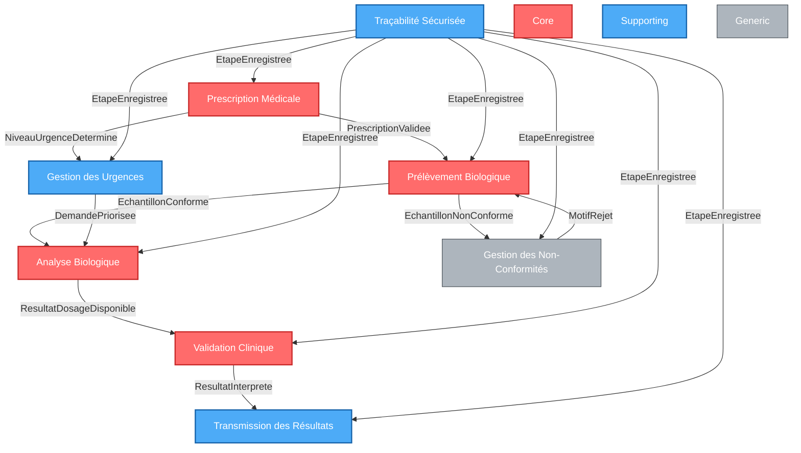

```mermaid
flowchart TD
    classDef core fill:#ff6b6b,stroke:#c92a2a,color:#fff,stroke-width:2px
    classDef supporting fill:#4dabf7,stroke:#1864ab,color:#fff,stroke-width:2px
    classDef generic fill:#adb5bd,stroke:#495057,color:#fff,stroke-width:1px

    Prescription[Prescription Médicale]:::core
    Prelevement[Prélèvement Biologique]:::core
    Analyse[Analyse Biologique]:::core
    Validation[Validation Clinique]:::core
    Transmission[Transmission des Résultats]:::supporting
    GestionUrgences[Gestion des Urgences]:::supporting
    Traçabilité[Traçabilité Sécurisée]:::supporting
    NonConformités[Gestion des Non-Conformités]:::generic

    Prescription -->|PrescriptionValidee| Prelevement
    Prescription -->|NiveauUrgenceDetermine| GestionUrgences
    Prelevement -->|EchantillonConforme| Analyse
    Prelevement -->|EchantillonNonConforme| NonConformités
    Analyse -->|ResultatDosageDisponible| Validation
    Validation -->|ResultatInterprete| Transmission
    GestionUrgences -->|DemandePriorisee| Analyse
    Traçabilité -->|EtapeEnregistree| Prescription
    Traçabilité -->|EtapeEnregistree| Prelevement
    Traçabilité -->|EtapeEnregistree| Analyse
    Traçabilité -->|EtapeEnregistree| Validation
    Traçabilité -->|EtapeEnregistree| Transmission
    Traçabilité -->|EtapeEnregistree| GestionUrgences
    Traçabilité -->|EtapeEnregistree| NonConformités
    NonConformités -->|MotifRejet| Prelevement

    Core[Core]:::core
    Supporting[Supporting]:::supporting
    Generic[Generic]:::generic
```