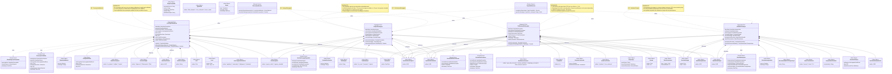

```mermaid
classDiagram
    %% ==================== Bounded Context : PrescriptionMédicale ====================
    note for PrescriptionMédicale "BC : PrescriptionMédicale"

    class PrescriptionMédicale {
        <<Aggregate Root>>
        +identifiant: IdentifiantPrescription
        +patientId: IdentifiantPatient
        +serviceDemandeur: ServiceClinique
        +anticoagulant: AnticoagulantOralDirect
        +dose: Dose
        +heureDernierePrise: DateHeure
        +dfg: DFG
        +motif: MotifPrescription
        +niveauUrgence: NiveauUrgence
        +statut: StatutPrescription
        +valider() ResultatValidation
        +determinerNiveauUrgence() NiveauUrgence
        +enregistrerModification(champs: ChampsModifies) Resultat
    }

    class IdentifiantPrescription {
        <<Value Object>>
        +valeur: UUID
    }

    class IdentifiantPatient {
        <<Value Object>>
        +valeur: UUID
    }

    class ServiceClinique {
        <<Value Object>>
        +valeur: "Urgences" | "Réanimation" | "Bloc"
    }

    class AnticoagulantOralDirect {
        <<Value Object>>
        +valeur: "apixaban" | "rivaroxaban" | "dabigatran" | "edoxaban"
    }

    class Dose {
        <<Value Object>>
        +valeur: Float
        +unite: "mg" | "UI"
    }

    class DateHeure {
        <<Value Object>>
        +valeur: DateTime
    }

    class DFG {
        <<Value Object>>
        +valeur: Float
    }

    class MotifPrescription {
        <<Value Object>>
        +valeur: String
    }

    class NiveauUrgence {
        <<Value Object>>
        +valeur: "urgence_vitale" | "urgence_standard"
    }

    class StatutPrescription {
        <<Value Object>>
        +valeur: "en_attente" | "validee" | "rejetee"
    }

    class ChampsModifies {
        <<Value Object>>
        +anticoagulant: AnticoagulantOralDirect?
        +dose: Dose?
        +heureDernierePrise: DateHeure?
        +dfg: DFG?
    }

    class ResultatValidation {
        <<Value Object>>
        +succes: Boolean
        +message: String?
    }

    PrescriptionMédicale *-- IdentifiantPrescription
    PrescriptionMédicale *-- IdentifiantPatient
    PrescriptionMédicale *-- ServiceClinique
    PrescriptionMédicale *-- AnticoagulantOralDirect
    PrescriptionMédicale *-- Dose
    PrescriptionMédicale *-- DateHeure
    PrescriptionMédicale *-- DFG
    PrescriptionMédicale *-- MotifPrescription
    PrescriptionMédicale *-- NiveauUrgence
    PrescriptionMédicale *-- StatutPrescription
    PrescriptionMédicale *-- ChampsModifies
    PrescriptionMédicale *-- ResultatValidation

    note for PrescriptionMédicale "INVARIANTS :
    - Une prescription doit avoir tous ses champs obligatoires remplis avant validation.
    - Le niveau d'urgence est déterminé automatiquement à la validation.
    - Toute modification d'une prescription validée doit être horodatée et tracée."

    class PrescriptionValidee {
        <<Domain Event>>
        +prescriptionId: IdentifiantPrescription
        +patientId: IdentifiantPatient
        +anticoagulant: AnticoagulantOralDirect
        +dose: Dose
        +heureDernierePrise: DateHeure
        +dfg: DFG
        +niveauUrgence: NiveauUrgence
        +timestamp: DateTime
    }

    class NiveauUrgenceDetermine {
        <<Domain Event>>
        +prescriptionId: IdentifiantPrescription
        +niveauUrgence: NiveauUrgence
        +timestamp: DateTime
    }

    PrescriptionMédicale ..> PrescriptionValidee : émet
    PrescriptionMédicale ..> NiveauUrgenceDetermine : émet

    %% ==================== Bounded Context : PrélèvementBiologique ====================
    note for PrélèvementBiologique "BC : PrélèvementBiologique"

    class PrélèvementBiologique {
        <<Aggregate Root>>
        +identifiant: IdentifiantEchantillon
        +prescriptionId: IdentifiantPrescription
        +operateurId: IdentifiantOperateur
        +heurePrelevement: DateHeure
        +tubePrelevement: TubePrelevement
        +volume: Volume
        +etiquetage: Etiquetage
        +statutConformite: StatutConformite
        +verifierConformite() ResultatConformite
        +enregistrerEtiquetage(etiquette: Etiquetage) Resultat
    }

    class IdentifiantEchantillon {
        <<Value Object>>
        +valeur: UUID
    }

    class IdentifiantOperateur {
        <<Value Object>>
        +valeur: UUID
    }

    class TubePrelevement {
        <<Value Object>>
        +type: "citrate_3.2%"
        +volumeMinimal: 2.0
    }

    class Volume {
        <<Value Object>>
        +valeur: Float
        +unite: "mL"
    }

    class Etiquetage {
        <<Value Object>>
        +nomPatient: String
        +heurePrelevement: DateHeure
        +serviceDemandeur: ServiceClinique
    }

    class StatutConformite {
        <<Value Object>>
        +valeur: "conforme" | "non_conforme"
    }

    class ResultatConformite {
        <<Value Object>>
        +succes: Boolean
        +motifsNonConformite: ListeMotifs?
    }

    class ListeMotifs {
        <<Value Object>>
        +valeurs: List<MotifNonConformite>
    }

    class MotifNonConformite {
        <<Value Object>>
        +valeur: "type_tube_incorrect" | "volume_insuffisant" | "etiquetage_incomplet" | "delai_transport_depasse"
    }

    PrélèvementBiologique *-- IdentifiantEchantillon
    PrélèvementBiologique *-- IdentifiantPrescription
    PrélèvementBiologique *-- IdentifiantOperateur
    PrélèvementBiologique *-- DateHeure
    PrélèvementBiologique *-- TubePrelevement
    PrélèvementBiologique *-- Volume
    PrélèvementBiologique *-- Etiquetage
    PrélèvementBiologique *-- StatutConformite
    PrélèvementBiologique *-- ResultatConformite
    PrélèvementBiologique *-- ListeMotifs
    PrélèvementBiologique *-- MotifNonConformite

    note for PrélèvementBiologique "INVARIANTS :
    - Le tube doit être de type citrate 3.2% avec un volume >= 2 mL.
    - L'étiquetage doit inclure le nom du patient, l'heure de prélèvement et le service demandeur.
    - Le délai de transport doit être < 30 minutes.
    - Toute non-conformité entraîne un rejet et une alerte."

    class EchantillonConforme {
        <<Domain Event>>
        +echantillonId: IdentifiantEchantillon
        +prescriptionId: IdentifiantPrescription
        +tubePrelevement: TubePrelevement
        +volume: Volume
        +etiquetage: Etiquetage
        +timestamp: DateTime
    }

    class EchantillonNonConforme {
        <<Domain Event>>
        +echantillonId: IdentifiantEchantillon
        +prescriptionId: IdentifiantPrescription
        +motifs: ListeMotifs
        +timestamp: DateTime
    }

    PrélèvementBiologique ..> EchantillonConforme : émet
    PrélèvementBiologique ..> EchantillonNonConforme : émet

    %% ==================== Bounded Context : AnalyseBiologique ====================
    note for AnalyseBiologique "BC : AnalyseBiologique"

    class AnalyseBiologique {
        <<Aggregate Root>>
        +identifiant: IdentifiantAnalyse
        +echantillonId: IdentifiantEchantillon
        +prescriptionId: IdentifiantPrescription
        +niveauUrgence: NiveauUrgence
        +statutAnalyse: StatutAnalyse
        +resultatDosage: ResultatDosage
        +prioriserDemande() ResultatPriorisation
        +realiserDosage() ResultatDosage
        +reporterAnalyse(motif: MotifReport) Resultat
    }

    class IdentifiantAnalyse {
        <<Value Object>>
        +valeur: UUID
    }

    class StatutAnalyse {
        <<Value Object>>
        +valeur: "en_cours" | "terminee" | "rejetee"
    }

    class ResultatDosage {
        <<Value Object>>
        +valeur: Float
        +unite: "UI/mL"
    }

    class MotifReport {
        <<Value Object>>
        +valeur: String
    }

    class ResultatPriorisation {
        <<Value Object>>
        +succes: Boolean
        +message: String?
    }

    AnalyseBiologique *-- IdentifiantAnalyse
    AnalyseBiologique *-- IdentifiantEchantillon
    AnalyseBiologique *-- IdentifiantPrescription
    AnalyseBiologique *-- NiveauUrgence
    AnalyseBiologique *-- StatutAnalyse
    AnalyseBiologique *-- ResultatDosage
    AnalyseBiologique *-- MotifReport
    AnalyseBiologique *-- ResultatPriorisation

    note for AnalyseBiologique "INVARIANTS :
    - Les demandes urgentes sont priorisées automatiquement.
    - Le délai de réponse doit être < 30 min pour les urgences vitales et < 1h pour les urgences standard.
    - Les échantillons non conformes sont rejetés.
    - Chaque analyse est tracée avec horodatage et identifiant."

    class ResultatDosageDisponible {
        <<Domain Event>>
        +analyseId: IdentifiantAnalyse
        +echantillonId: IdentifiantEchantillon
        +prescriptionId: IdentifiantPrescription
        +resultatDosage: ResultatDosage
        +timestamp: DateTime
    }

    AnalyseBiologique ..> ResultatDosageDisponible : émet

    %% ==================== Bounded Context : ValidationClinique ====================
    note for ValidationClinique "BC : ValidationClinique"

    class ValidationClinique {
        <<Aggregate Root>>
        +identifiant: IdentifiantInterpretation
        +analyseId: IdentifiantAnalyse
        +prescriptionId: IdentifiantPrescription
        +contexteClinique: ContexteClinique
        +resultatDosage: ResultatDosage
        +interpretationResultat: InterpretationResultat
        +statutTransmission: StatutTransmission
        +interpreterResultat() ResultatInterpretation
        +formulerRecommandation() RecommandationTherapeutique
    }

    class IdentifiantInterpretation {
        <<Value Object>>
        +valeur: UUID
    }

    class ContexteClinique {
        <<Value Object>>
        +traitement: AnticoagulantOralDirect
        +dfg: DFG
        +heureDernierePrise: DateHeure
    }

    class InterpretationResultat {
        <<Value Object>>
        +commentaire: String
    }

    class StatutTransmission {
        <<Value Object>>
        +valeur: "envoye" | "recue" | "lu"
    }

    class RecommandationTherapeutique {
        <<Value Object>>
        +texte: String
    }

    class ResultatInterpretation {
        <<Value Object>>
        +succes: Boolean
        +message: String?
    }

    ValidationClinique *-- IdentifiantInterpretation
    ValidationClinique *-- IdentifiantAnalyse
    ValidationClinique *-- IdentifiantPrescription
    ValidationClinique *-- ContexteClinique
    ValidationClinique *-- ResultatDosage
    ValidationClinique *-- InterpretationResultat
    ValidationClinique *-- StatutTransmission
    ValidationClinique *-- RecommandationTherapeutique
    ValidationClinique *-- ResultatInterpretation

    note for ValidationClinique "INVARIANTS :
    - L'interprétation doit intégrer le contexte clinique (traitement, DFG, heure dernière prise).
    - La recommandation thérapeutique doit être claire et actionnable.
    - Les résultats interprétés sont transmis en temps réel aux prescripteurs."

    class ResultatInterprete {
        <<Domain Event>>
        +interpretationId: IdentifiantInterpretation
        +prescriptionId: IdentifiantPrescription
        +contexteClinique: ContexteClinique
        +interpretationResultat: InterpretationResultat
        +recommandation: RecommandationTherapeutique
        +timestamp: DateTime
    }

    ValidationClinique ..> ResultatInterprete : émet

    %% ==================== Relations entre Bounded Contexts ====================
    PrescriptionMédicale --> IdentifiantPrescription : référence
    PrescriptionMédicale --> IdentifiantPatient : référence
    PrescriptionMédicale --> ServiceClinique : référence

    PrélèvementBiologique --> IdentifiantPrescription : référence
    PrélèvementBiologique --> IdentifiantEchantillon : référence

    AnalyseBiologique --> IdentifiantEchantillon : référence
    AnalyseBiologique --> IdentifiantPrescription : référence
    AnalyseBiologique --> NiveauUrgence : référence

    ValidationClinique --> IdentifiantAnalyse : référence
    ValidationClinique --> IdentifiantPrescription : référence
    ValidationClinique --> ResultatDosage : référence

    %% ==================== Domain Services (inter-BC) ====================
    class PriorisationService {
        <<Domain Service>>
        +prioriserDemande(prescription: PrescriptionMédicale) NiveauUrgence
        +surveillerDelais(prescriptionId: IdentifiantPrescription) Resultat
    }

    class TraçabilitéService {
        <<Domain Service>>
        +enregistrerEtape(etape: EtapeTraçabilité) Resultat
        +genererAlerte(type: TypeAlerte, message: String) Alerte
    }

    class EtapeTraçabilité {
        <<Value Object>>
        +boundedContext: String
        +action: String
        +horodatage: DateTime
        +acteur: String
        +identifiantUnique: String
    }

    class TypeAlerte {
        <<Value Object>>
        +valeur: "delai_depasse" | "non_conformite" | "erreur_saisie"
    }

    class Alerte {
        <<Value Object>>
        +type: TypeAlerte
        +message: String
        +timestamp: DateTime
    }

    PriorisationService ..> PrescriptionMédicale : utilise
    PriorisationService ..> AnalyseBiologique : utilise
    TraçabilitéService ..> PrescriptionMédicale : utilise
    TraçabilitéService ..> PrélèvementBiologique : utilise
    TraçabilitéService ..> AnalyseBiologique : utilise
    TraçabilitéService ..> ValidationClinique : utilise
```